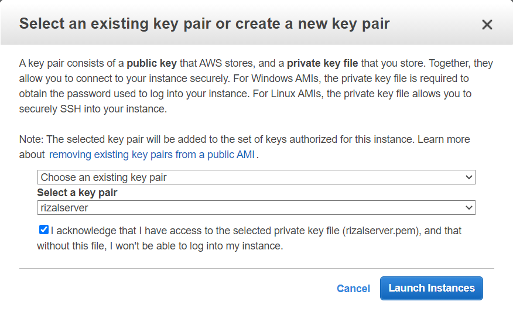

# SERVER FOR REVERSE PROXY

- Memilih OS yang akan digunakan untuk server, dalam hal ini Ubuntu server 18.04

- Memilih spesifikasi server, tidak perlu terlalu besar karena hanya akan digunakan untuk mendeploy aplikasi sederhana

- Konfigurasi koneksi yang akan digunakan oleh server, pastikan memilih opsi **Disable** pada `Auto-assign Public IP` agar ip menjadi static dan tidak akan berubah - ubah setelah server di restart

- Memilih storage yang akan digunakan, disini yang saya ganti hanya bagian `Size` dari default 8GB menjadi 10GB.

- Configurasi security group agar user hanya bisa mengakses beberapa port yang sudah di sediakan, dalam hal ini yang dibutuhkan adalah: 

	- SSH   : agar server bisa diakses lewat komputer lokal 
	- HTTP  : agar website bisa diakses public
	- HTTPS : agar website bisa dipasang SSL 

- Buat key pair baru yang nantinya digunakan untuk login ke server menggunakan SSH

- Setelah proses instalasi server selesai, server sebelumnya tidak memiliki public ip, jadi harus ditambahkan Elastic IP terlebih dahulu agar server bisa diakses dari komputer lokal

- Tambahkan Elastic Ip yang sudah didapat ke server public

---

# SERVER FOR APPLICATION

Untuk konfigurasi server Private cara konfigurasinya kurang lebih sama, hanya pada `Configure Security Group` cukup menggunakan All trafic, kemudian Source diganti Ip Private milik Server Public. Server ini juga tidak memerlukan Elastic IP.

Pada gambar diatas sementara saya masukan Ip dari komputer yang saya gunakan untuk menambahkan user baru agar tidak perlu menggunakan key-pair saat login dari server public.

---
# SSH KE SERVER 

Cara berikut saya lakukan pada kedua server untuk menghilangkan key-pair saat login:

- Login dari terminal lokal menggunakan perintah `ssh -1 key-pair ubuntu@ip-public` 

- Tambahkan user baru dengan perintah `adduser nama-user` kemudian beri akses sudo menggunakan `usermod -aG sudo nama-user`

- Edit file yang ada dalam `/etc/ssh/sshd_config` dan ganti `PasswordAuthentication` dari No ke Yes 

-Restart sshd dan coba login menggunakan user baru

