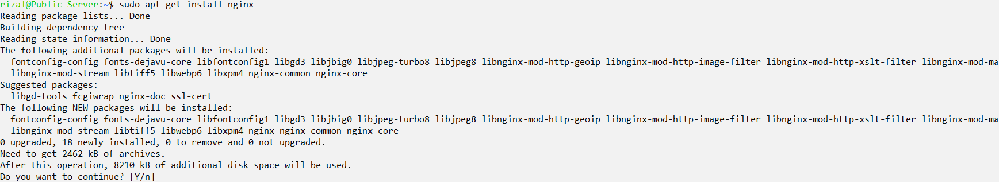
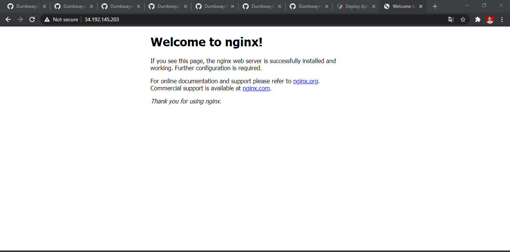
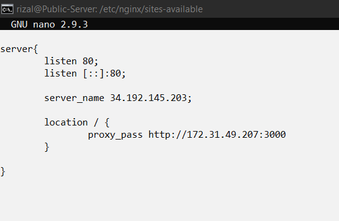
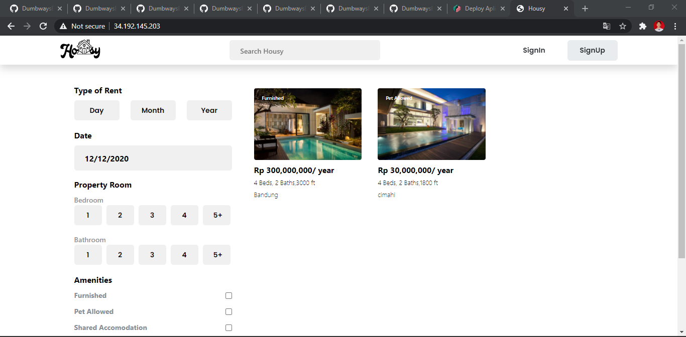

# Reverse Proxy

- update dan server dengan perintah `apt-get update && apt-get upgrade`, Setelah itu install nginx dengan perintah `apt-get install nginx`

- Lalu cek nginxnya dengan memasukan ip public server

- Lalu buat file housy.conf di `/etc/nginx/sites-available/` dan isi dengan settingan seperti berikut

- Lalu cek reverse proxynya dengan memasukan ip public di browser, jika muncul, berarti reverse proxynya sudah tersambung dengan server private

