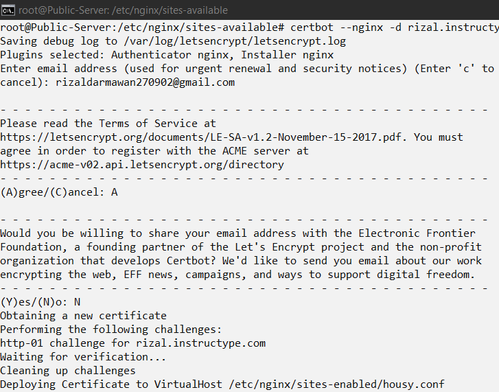
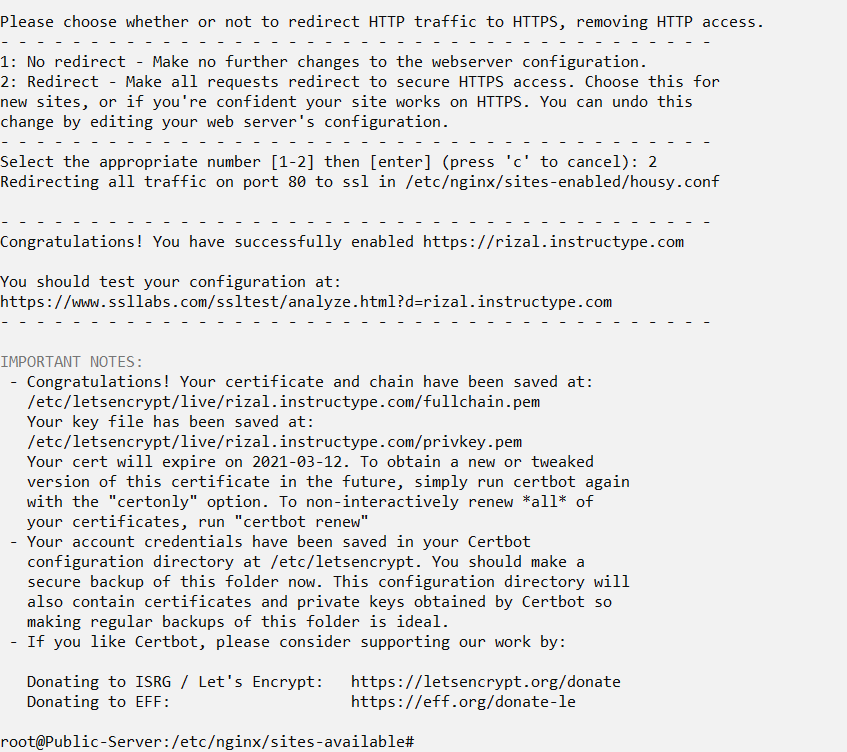
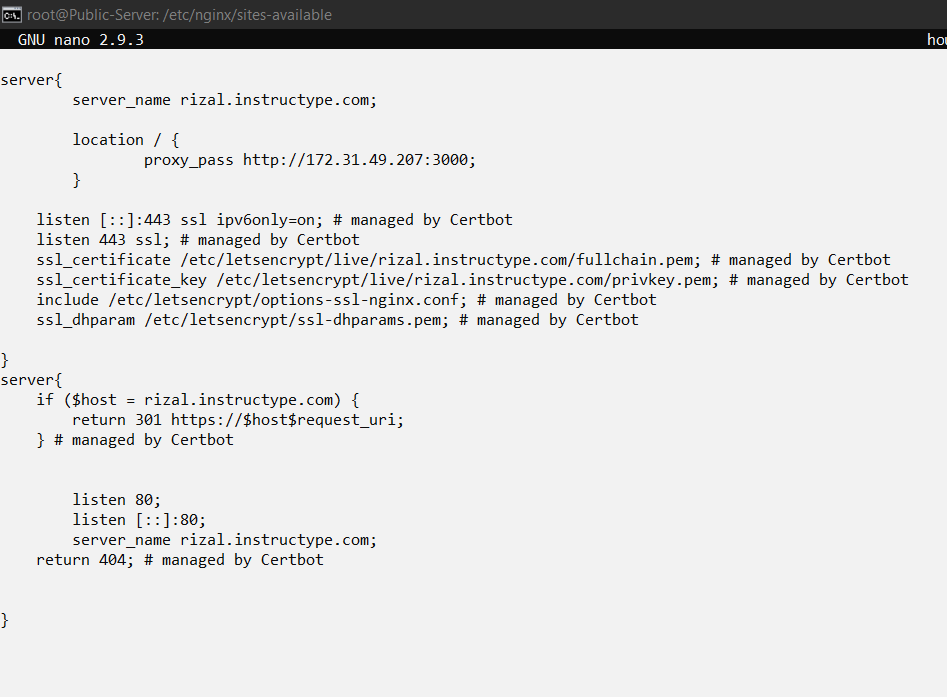
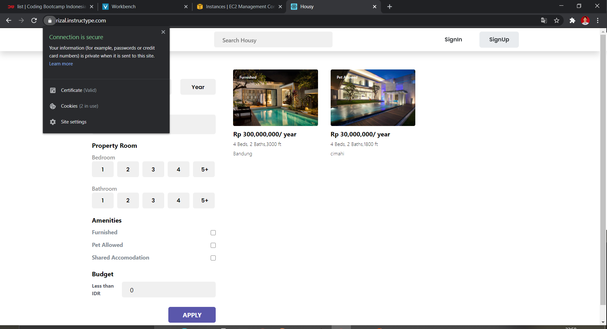

# SSL

- masukan perintah-perintah dibawah untuk menginstall certbot

```
sudo add-apt repository ppa:certbot/certbot
sudo apt-get update
sudo apt-get install python-certbot-nginx
```
- Setelah itu masukan perintah `certbot --nginx -d rizal.instructype.com` dan ikuti sesuai gambar




- Kemudian cek file `/etc/nginx/sites-available/housy.conf`



- Terakhir cek ssl pada browser

