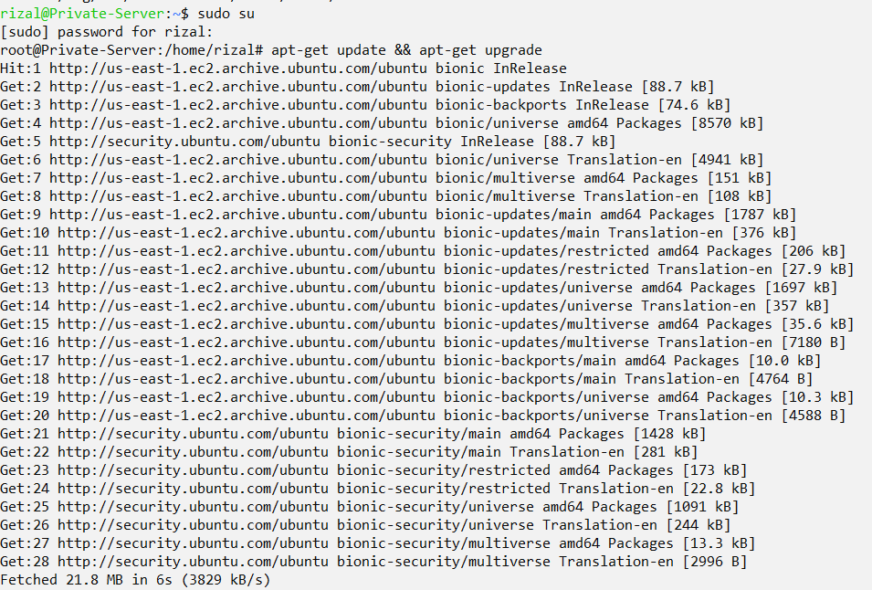
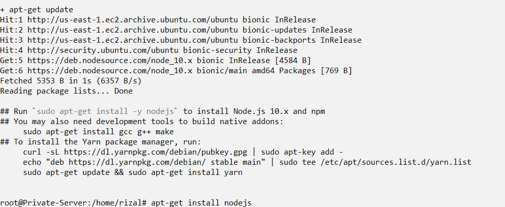
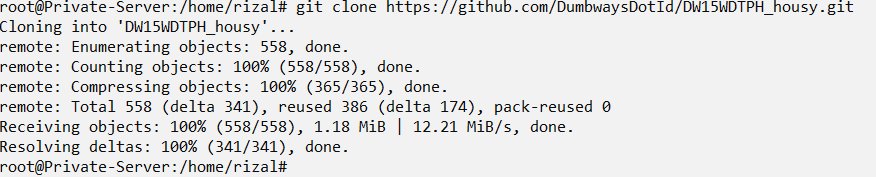
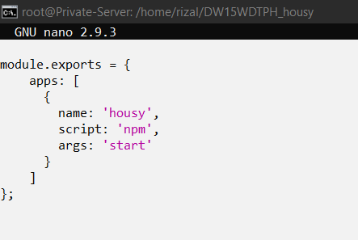
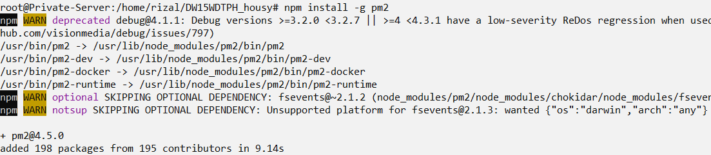
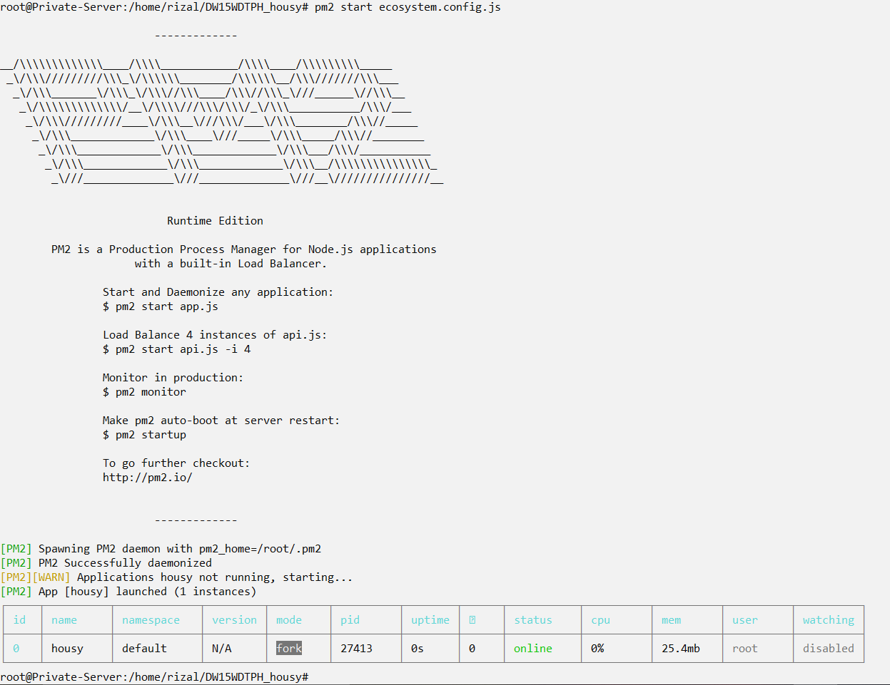

# Server Application

- Pertama kita update dan upgrade dengan perintah `apt-get update && apt-get upgrade`

- lalu kita tambahkan repo nodejs dengan perintah `curl -sL https://deb.nodesource.com/setup_10.x | bash -`, dan setelah selesai kita install nodejsnya dengan perintah `apt-get install nodejs`

- Setelah itu kita clone repo git aplikasi housy

- lalu didalam folder housy, kita buat file `ecosystem.config.js`, dan isi seperti berikut

- Setelah itu masukan perintah `npm install`, dan setelah selesai kita install pm2 dengan perintah `npm install -g pm2`

- Terakhir jalankan aplikasi oleh pm2 dengan memasukan perintah `pm2 start ecosystem.config.js`

