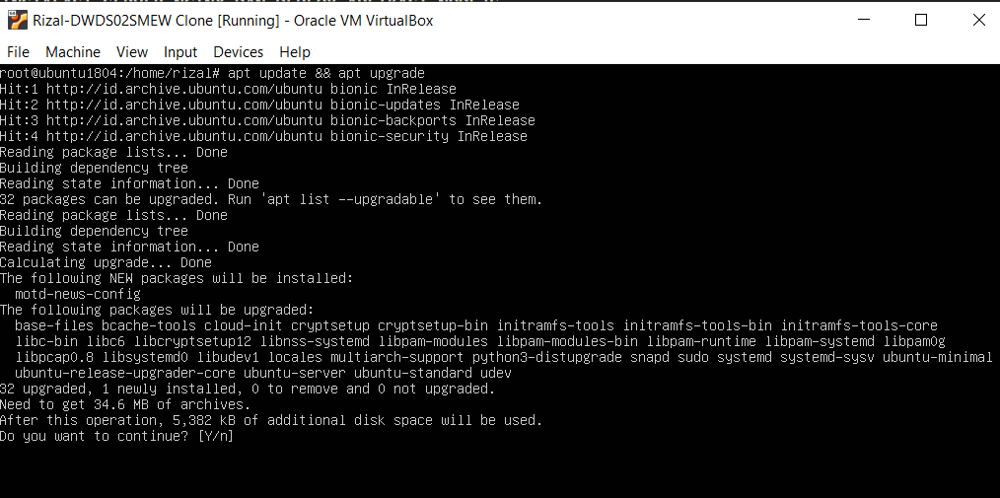
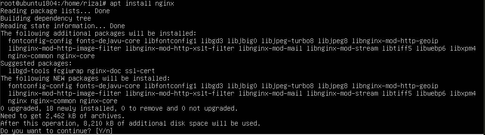
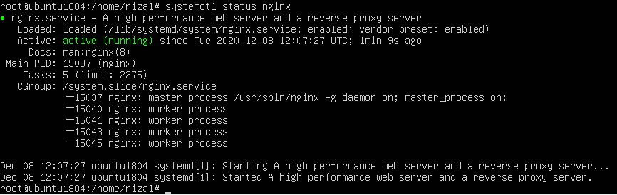
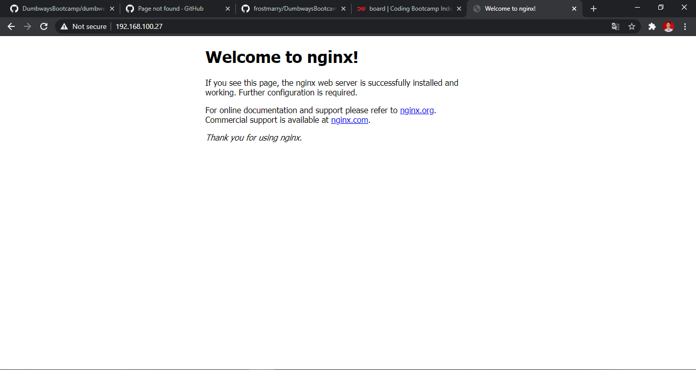
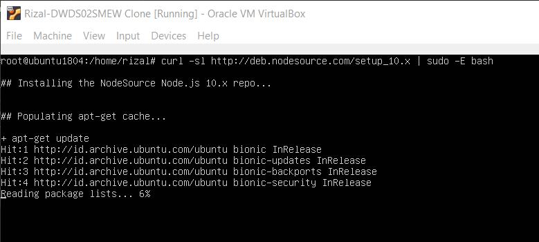
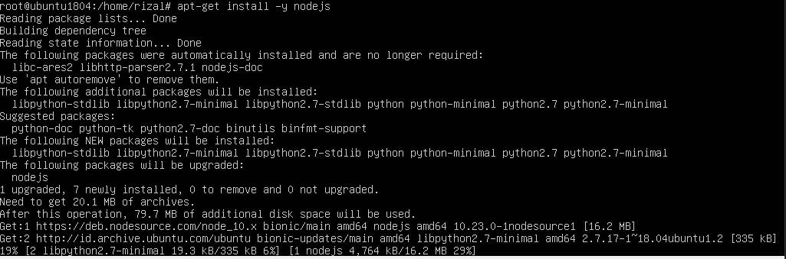
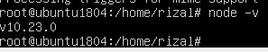
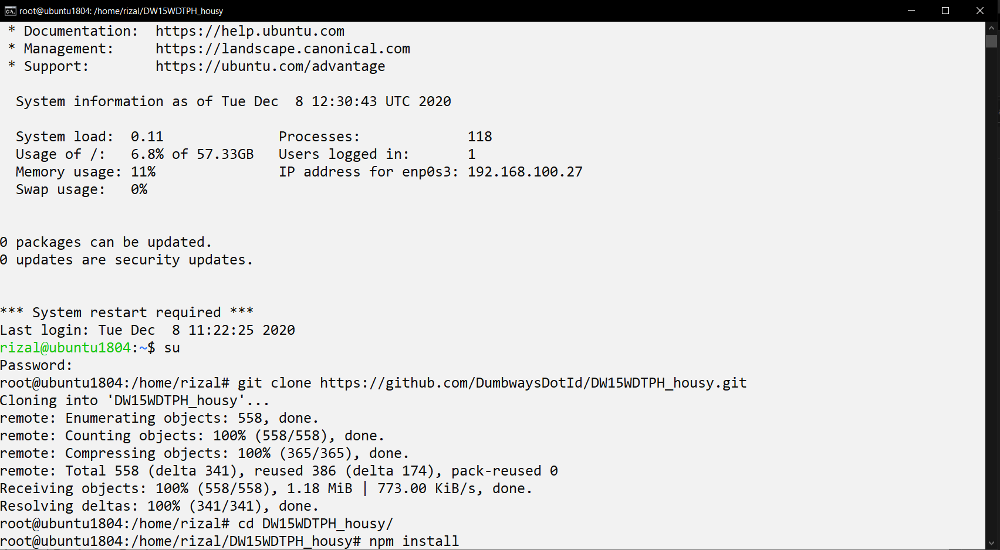
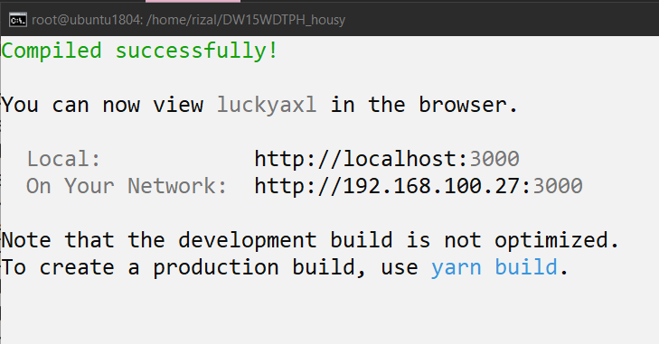
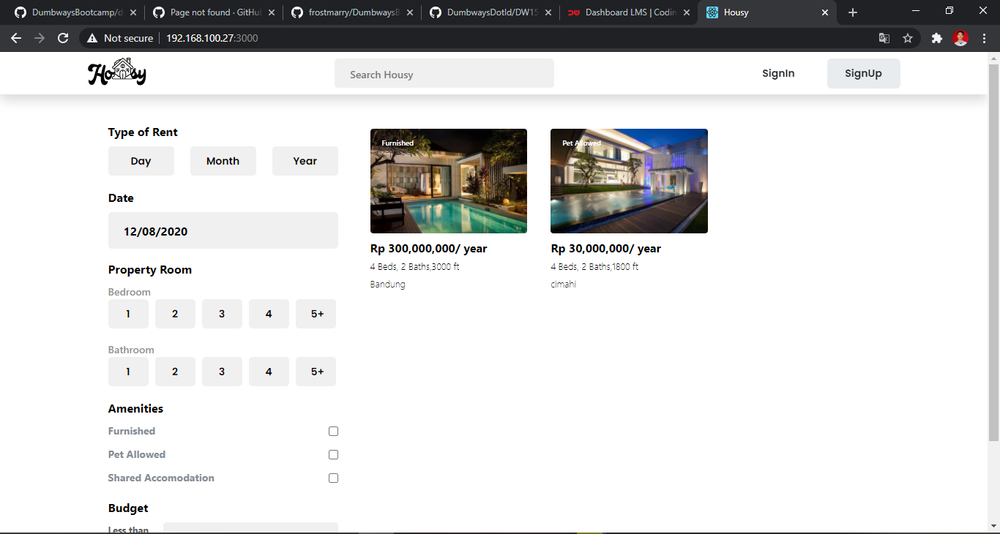

# PROSES INSTALASI SERVER NGINX DAN DEPLOY APLIKASI NODEJS
## Instalasi Nginx
1. Hal pertama yang harus dilakukan setelah instalasi server ubuntu ialah mengupdate dan upgrade paket yang sudah ada dengan perintah `apt update && apt upgrade` lakukan dengan root. 

2. setelah proses update & upgrade selesai barulah install nginx dan cek servicenya setelah selesai.

3. uji coba mengakses server nginx pada komputer lokal dengan cara memasukkan ip server

## Instalasi NodeJS dan deploy DW15WDTPH_housy

1. untuk melakukan instalasi nodejs versi 10.x, kita akan menginstall dari web nodejs dengan perintah `curl -sl https://deb.nodesource.com/setup_10.x | sudo -E bash`, dan setelah itu install menggunakan perintah `apt-get -y install nodejs`

2. clone repository yang ada pada https://github.com/DumbwaysDotId/DW15WDTPH_housy.git ke server local untuk nantinya dideploy. Setelah itu cd ke DW15WDTPH_housy dan install semua paket dengan perintah npm install

3. selanjutnya jika semua paket terinstall, jalankan perintah `npm start` agar aplikasi bisa diakses pada komputer local

4. hasil setelah dijalankan pada komputer lokal

