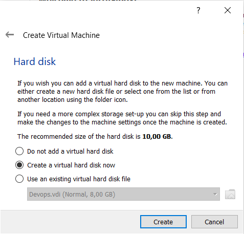
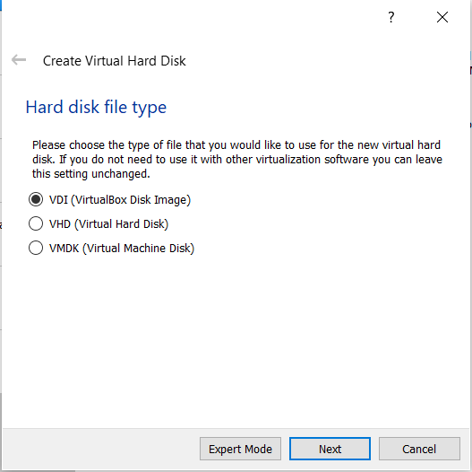
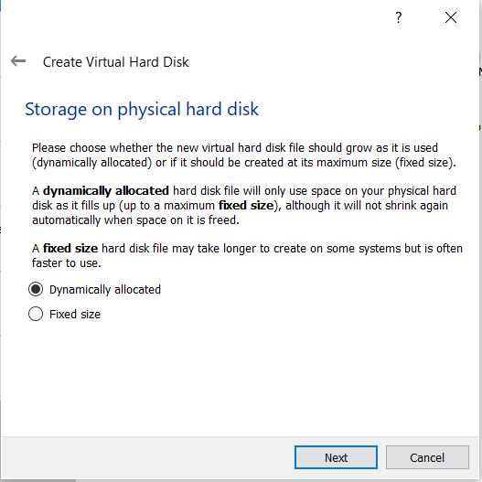
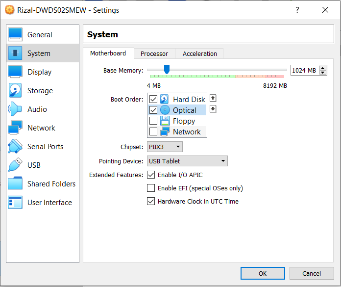
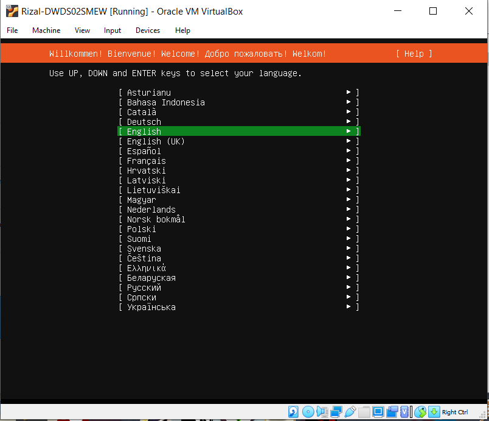
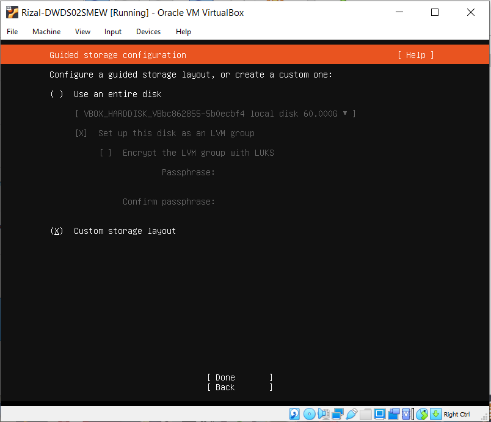
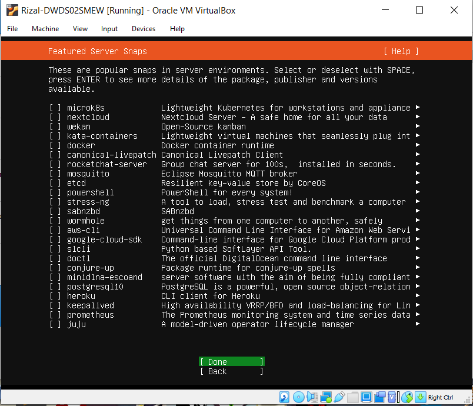
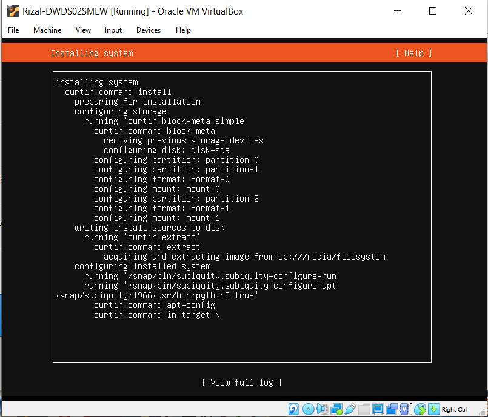
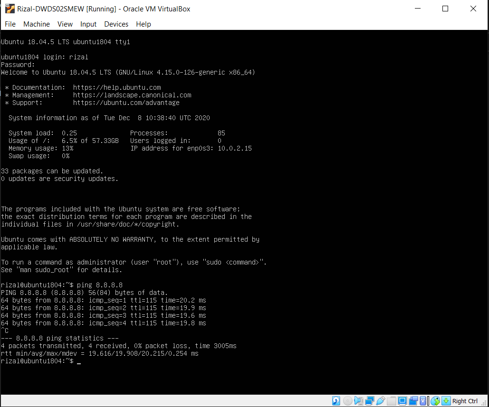

# Instalasi Ubuntu Server 18.04 pada Virtual Box

1. Membuat nama operating system dengan format nama-nim

2. Mengatur ukuran ram yang akan digunakan

3. Membuat hardisk virtual beserta mengalokasikan ukuran hardisk sebesar 60GB

4. Menambahkan file iso kedalam disk virtual untuk nantinya di install 

5. Setting Storage dengan urutan dibawah, agar tak usah setting lagi setelah selesai install

6. klik install ubuntu server dan ikuti langkah selanjutnya hingga sampai tahap storage configuration

7. untuk konfigurasi storage digunakan 1GB untuk swap dan 59GB untuk root

8. klik done terus sampai tahap menentukan nama dan user server dan install openssh

9. tunggu sampai instalasi selesai, kemudian restart vm

10. Selesai

