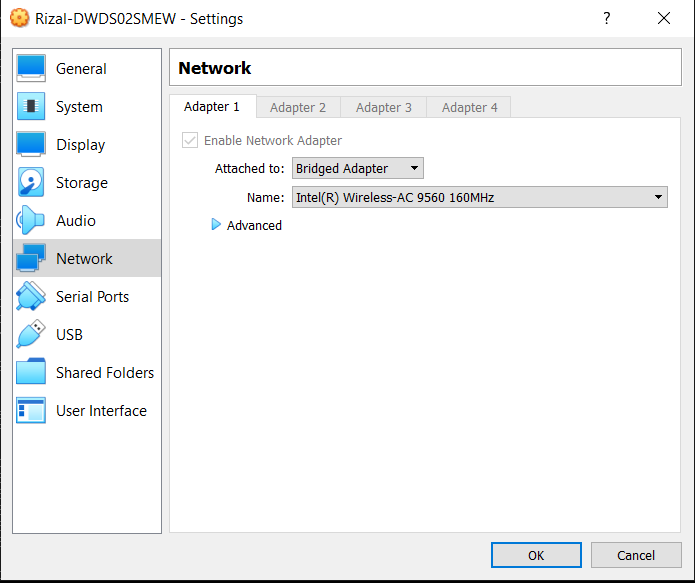
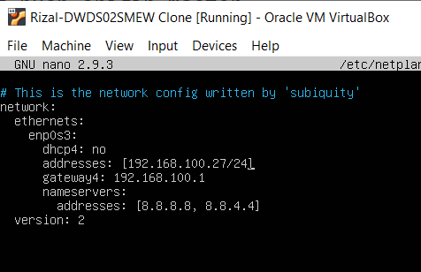
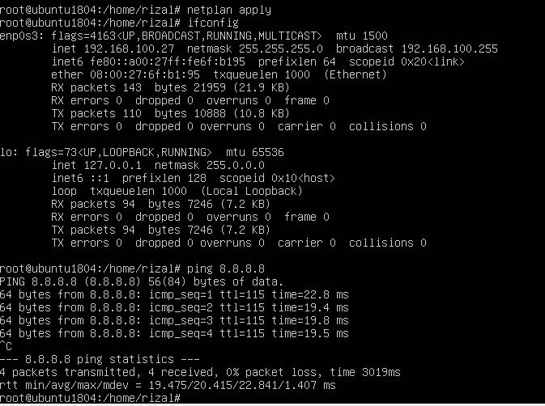

# KONFIGURASI VM AGAR DAPAT TERHUBUNG KE JARINGAN INTERNET

1. ubah adapter dari NAT ke Bridged Adapter kemudian pilih hardware komputer lokal yang terhubung ke internet (dalam kasus saya wlp2s0)

2. kemudian edit /etc/netplan/00-installer-config.yaml dengan root

3. setelah selesai mengedit, restart network dengan perintah `netplan apply`, dan masukan perintah `ifconfig` untuk mengecek koneksi internet

