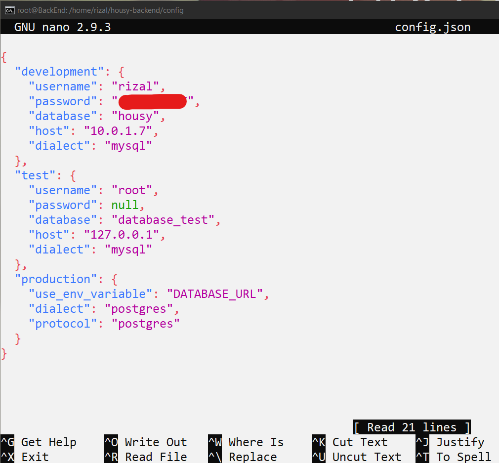
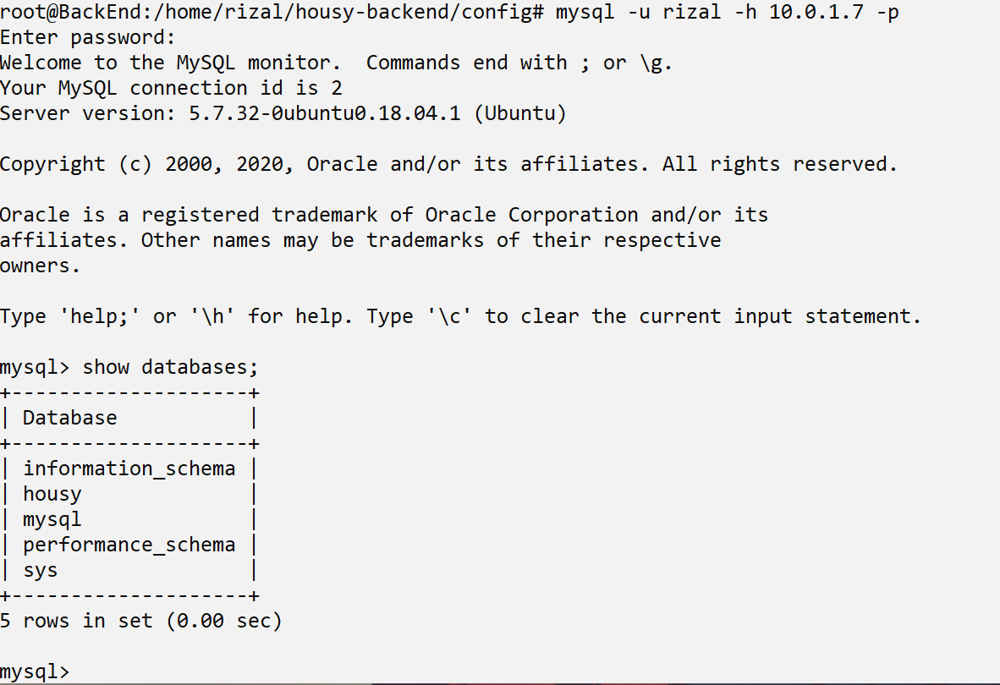
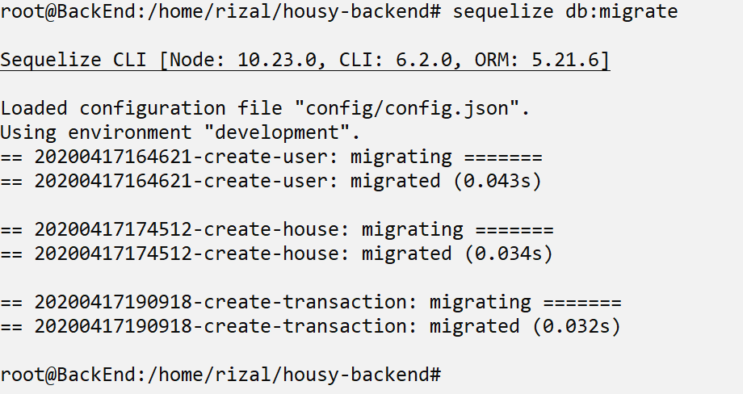
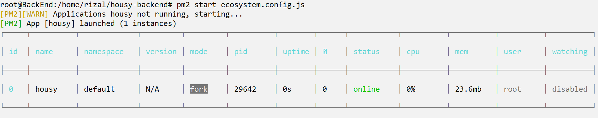

# Backend Deployment

- Remote Server Backend, dan edit file housy-backend/config/config.json, dengan mengubah user, password, nama database, dan ip server database pada bagian development

- dan jangan lupa juga install library pendukung seperti nodejs dan pm2 seperti minggu 1, dan install juga sequelize dengan perintah `npm install -g sequelize-cli` untuk migrasi database

- Sebelum migrasi database, install mysql client terlebih dahulu dengan perintah `apt-get install mysql-client` dan login ke database server dengan perintah `mysql -u user -h IpServerDatabase -p`, dan lihat list database dengan perintah `show databases;`

- Lalu migrate database dengan perintah `sequelize db:migrate`, pastikan di direktori `housy-backend`

- Terakshir jalankan backend dengan pm2

