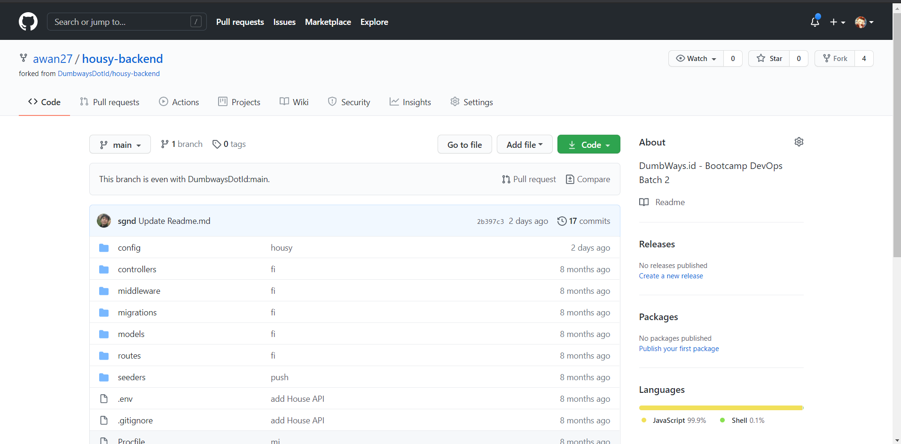
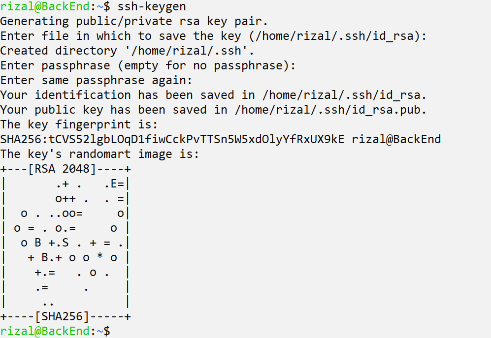
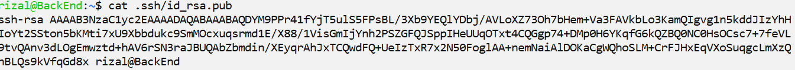
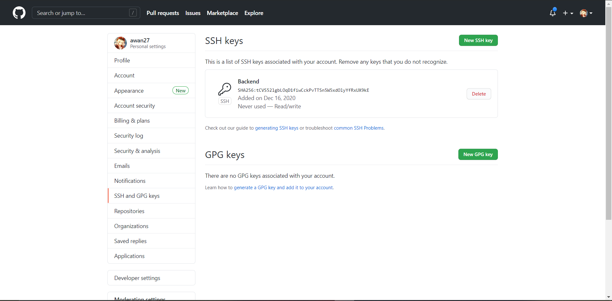
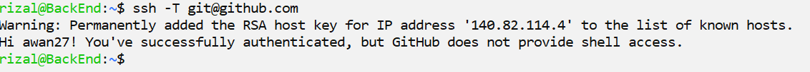
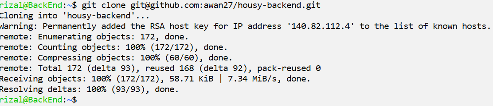
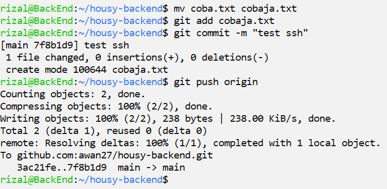

# SSH Key

- Pertama Fork dulu repo housy-backend di `https://github.com/DumbwaysDotId/housy-backend`

- lalu login ke server backend, lalu masukan perintah `ssh-keygen`

- lalu lihat keynya dengan perintah cat id_rsa.pub dan salin

- Masukan keynya di github

- Sambungkan SSH ke github

- Clone Repo backendnya dengan ssh

- Coba push file baru untuk coba apakah berhasil

