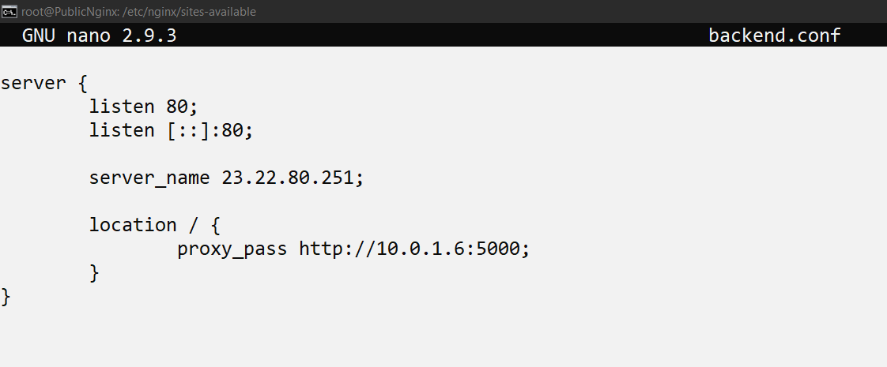
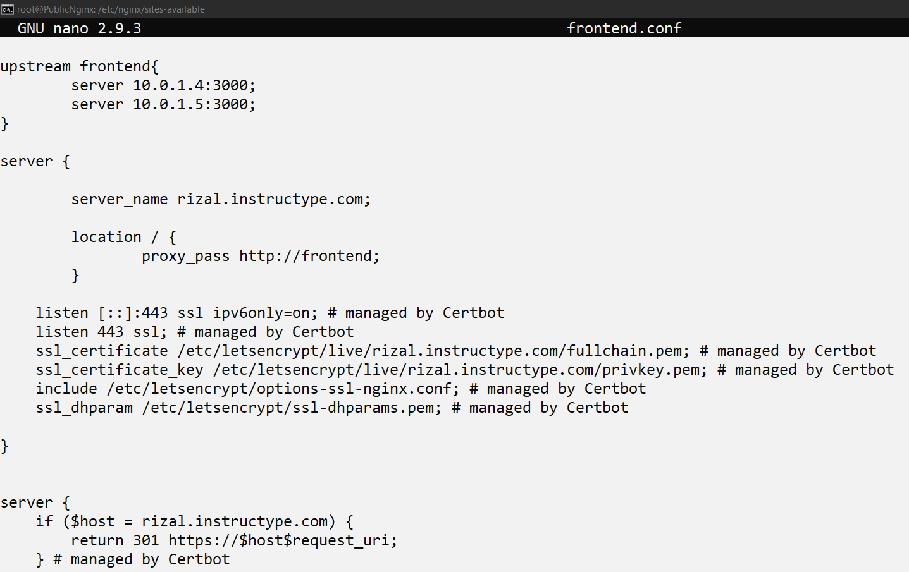

# Reverse Proxy

- Buat reverse proxy untuk backend `/etc/nginx/sites-available/backend.conf`

- Buat reverse proxy dan load balance untuk frontend `/etc/nginx/sites-available/frontend.conf`

- link files confignya ke site enabled dengan perintah 
` ln /etc/nginx/sites-available/backend.conf /etc/nginx/sites-enabled/backend.conf`
` ln /etc/nginx/sites-available/frontend.conf /etc/nginx/sites-enabled/frontend.conf`