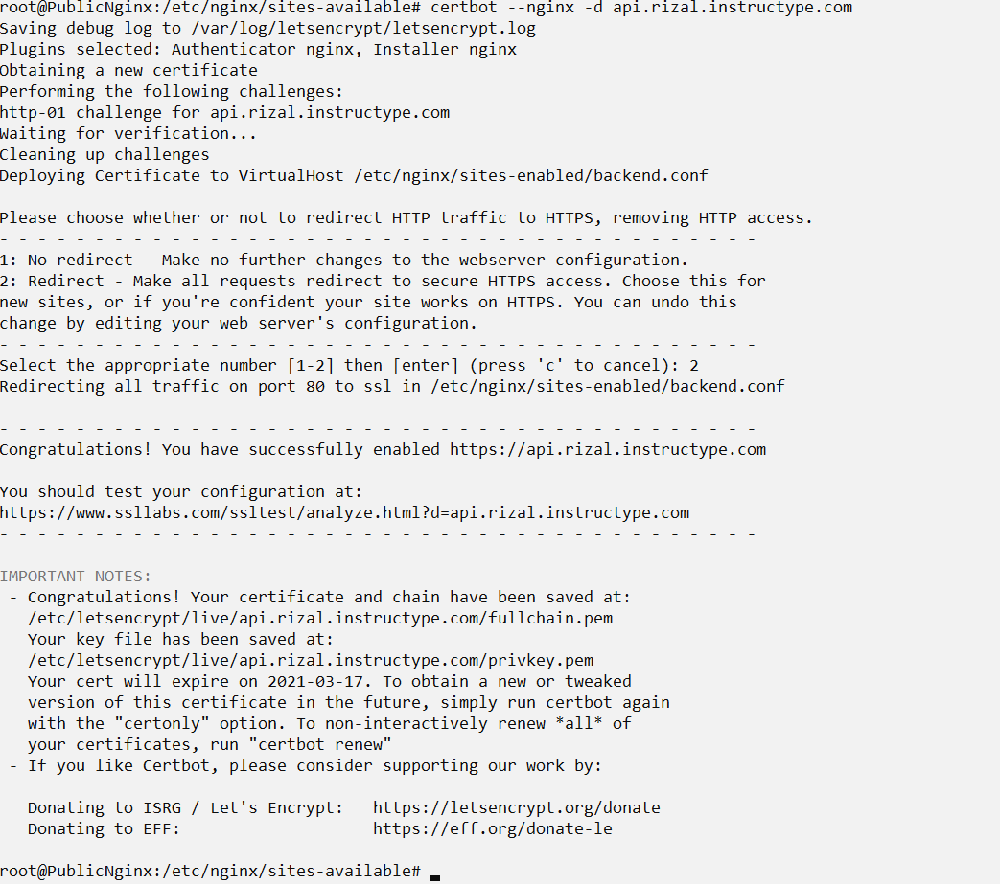
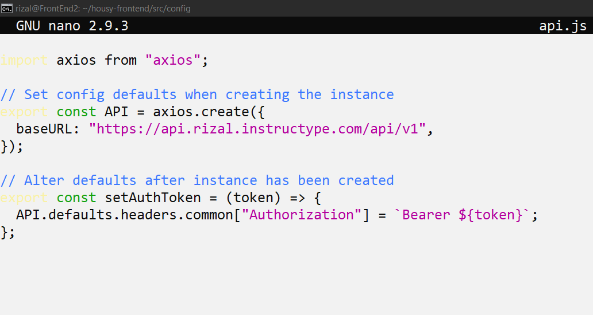
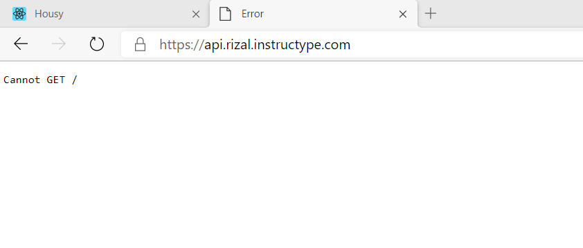
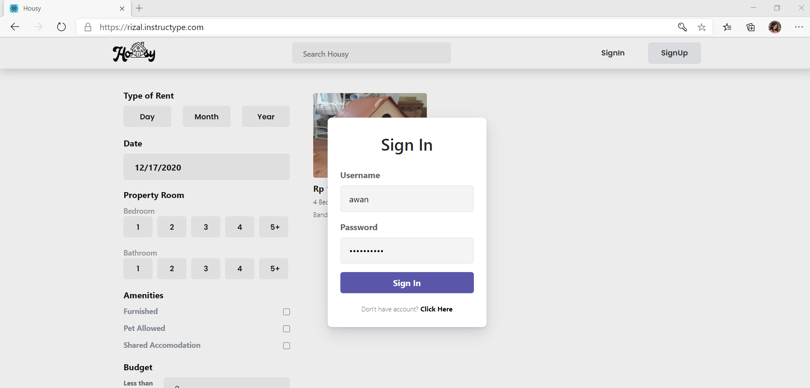
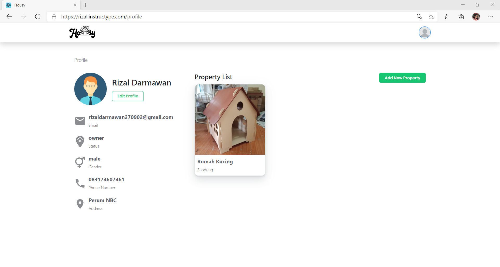

# SSL Configuration

- Karena saya sudah ada certbot, saya akan langsung konfig dengan menjalankan perintah `certbot --nginx -d api.rizal.instructype.com`

- Di Frontend masukan link backend

- Cek sslnya di browser

- Tes login dengan app housy

- Setelah semua konfig dari awal sampai akhir selesai, bisa di cek di web

