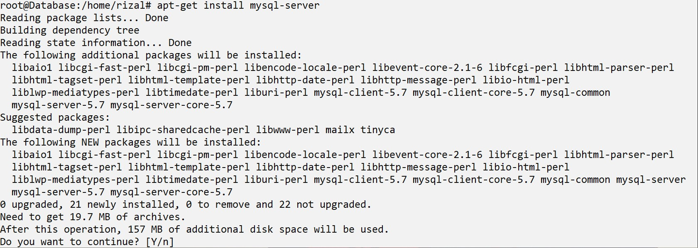
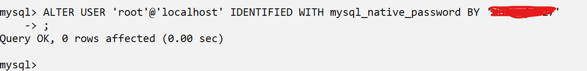
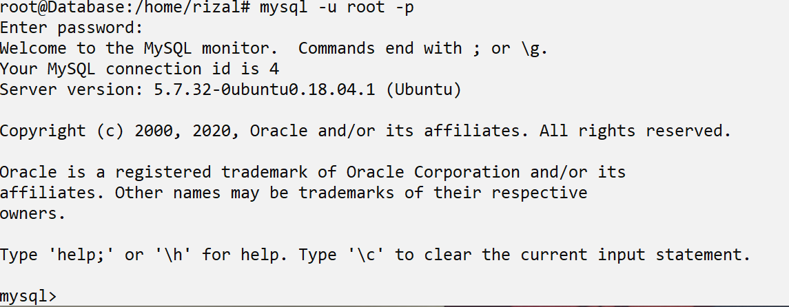
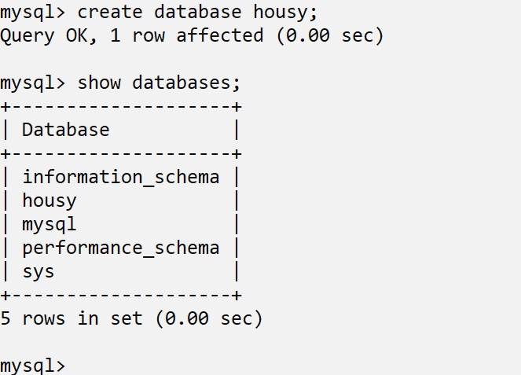
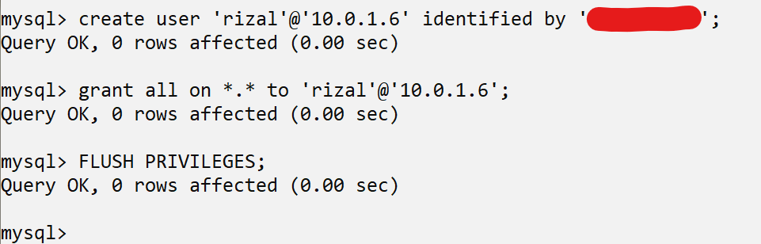
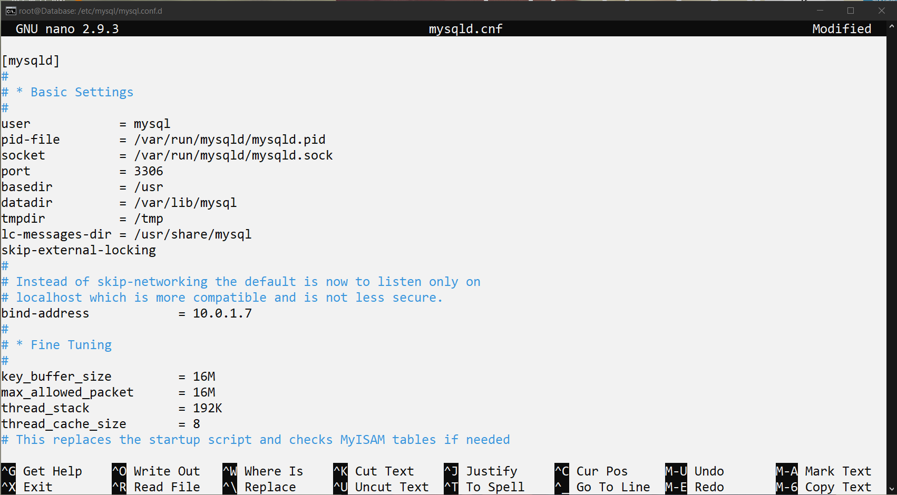

# Setup Database

- Install mysql server dengan perintah `apt-get install mysql-server`



- Sekarang kita akan mengubah password user root dengan perintah `ALTER USER 'root'@'localhost' IDENTIFIED WITH mysql_native_password BY 'passwordbaru`, tapi masuk ke mysql terlebih dahulu dengan perintah `sudo mysql -u root`



- Setelah itu coba buat database housy dengan user root




- Sekarang kita akan buat user untuk login `server backend`, agar `server backend` dapat mengakses `server database`

```
create user 'namauser'@'ip-server-backend' identified by 'password'; 

grant all on *.* to 'namauser'@'ip-server-backend';

FLUSH PRIVILEGES;
```



- Terakhir ubah bind-address mysql agar ipnya dapat diakses `server backend`


