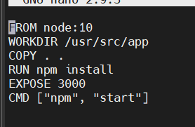
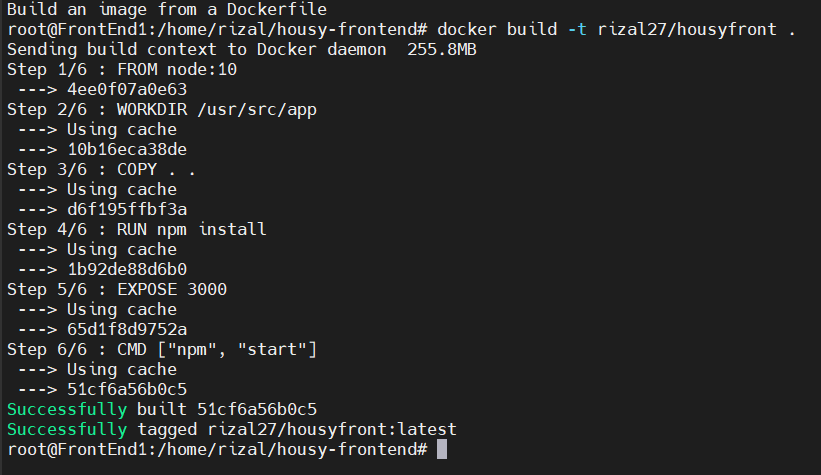
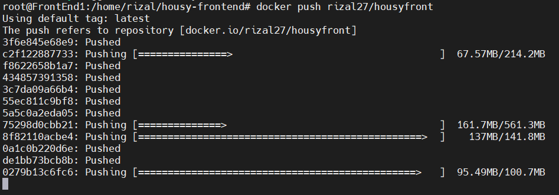

# Create Docker Image

- Masuk ke folder housy, lalu buat Dockerfile dengan konfigurasi seperti berikut

- Lalu masukan perintah `docker build -t usernamedocker/namaimage`

- Lalu push ke docker hub dengan perintah `docker push usernamedocker/namaimage`

