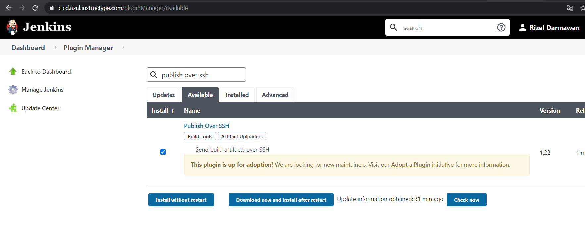
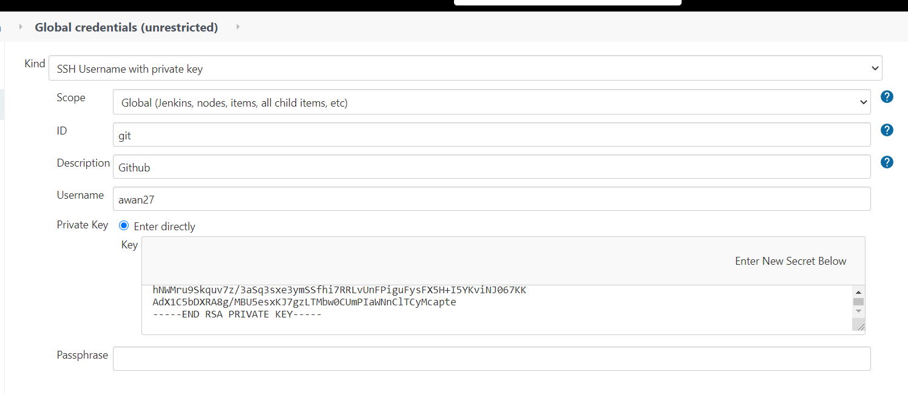
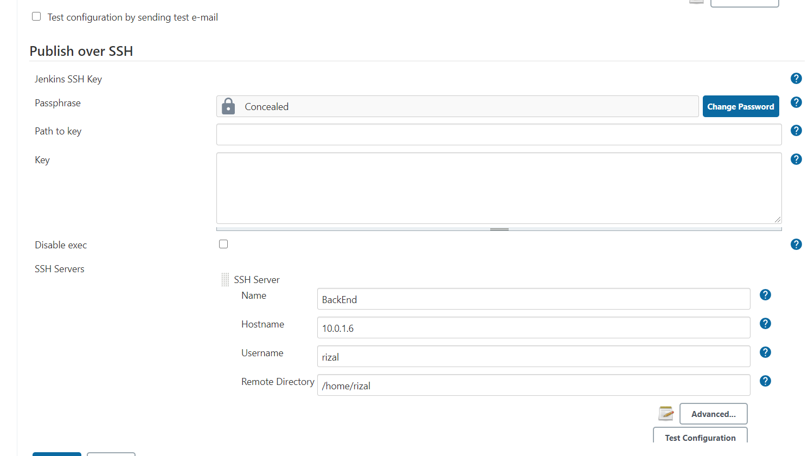
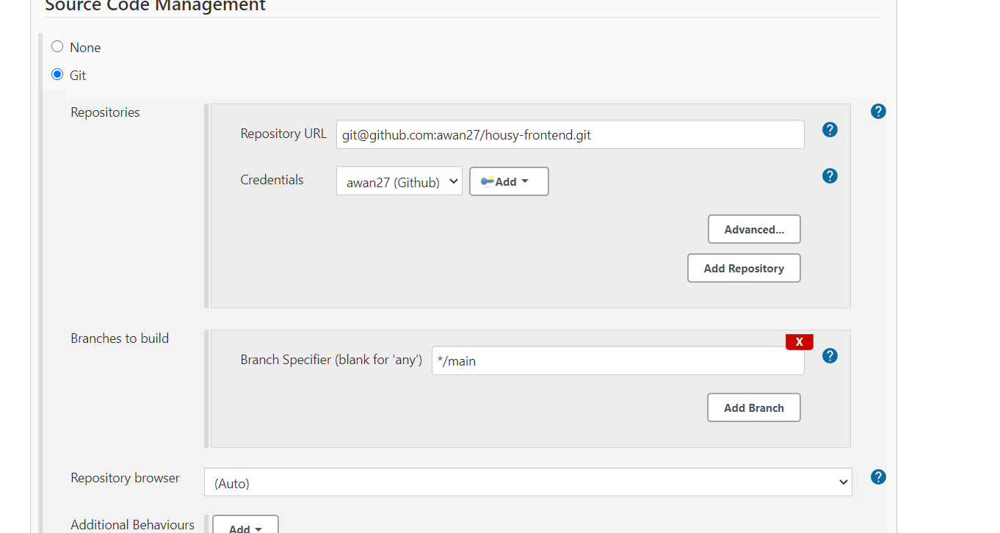
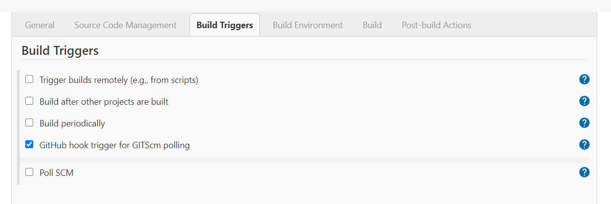
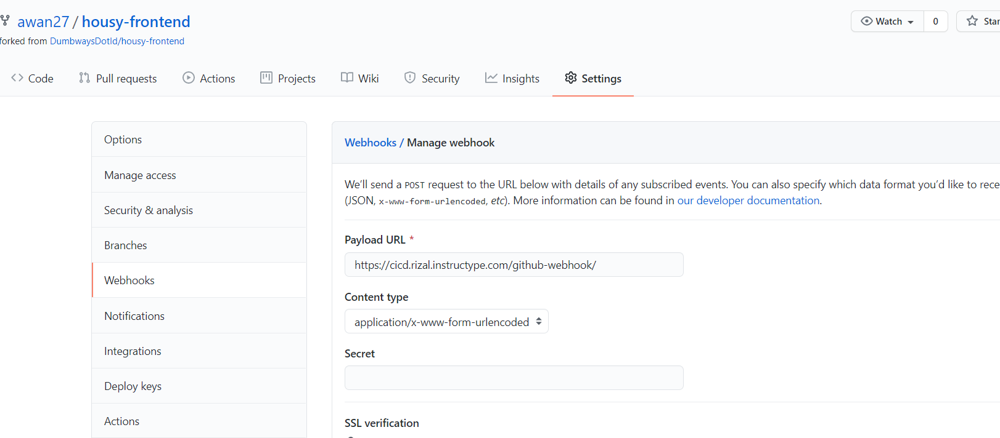
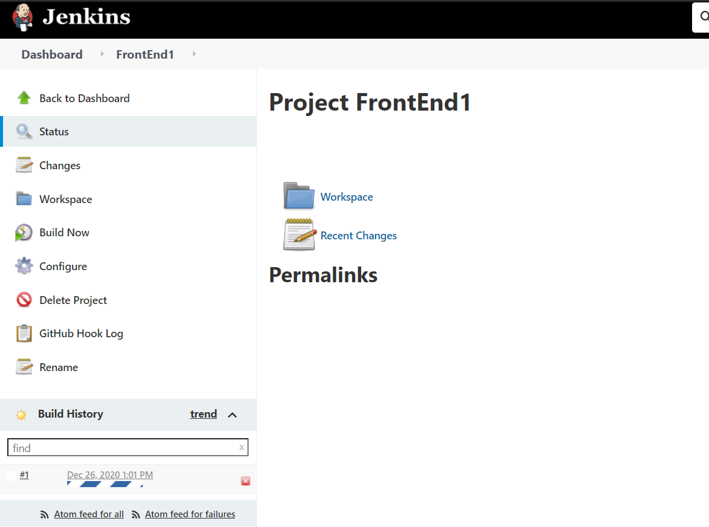
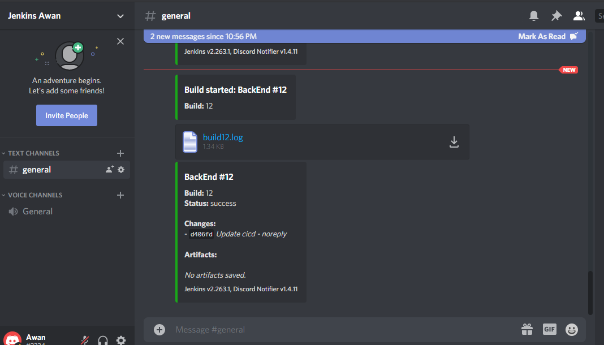

# Create Jenkins Job

- Masukan Plugin untuk SSH

- Lalu buat kredensial untuk login git jalur SSH

- Masukan server dengan plugin over SSH

- Lalu buat job baru dengan freestyle, dan konfigurasi seperti gambar dibawah

- Pada repo di github, kita akan buat webhook untuk trigger jenkins

- Coba ubah repo github, pada jenkins akan otomatis build dari repo setiap ada push baru

- dan untuk bot notif, saya menggunakan Discord

