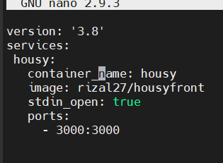
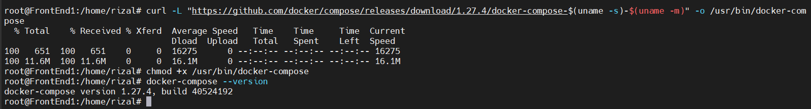
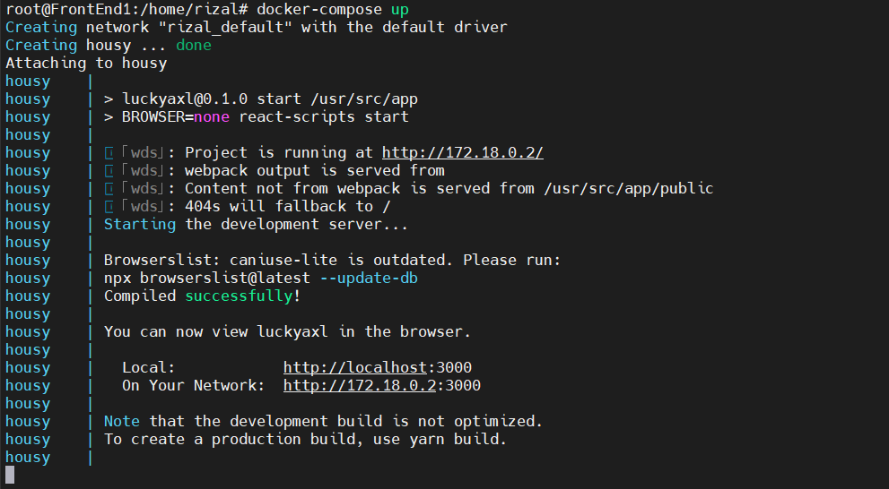
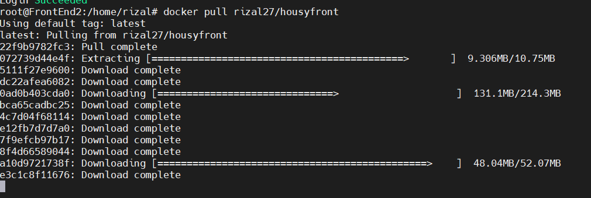
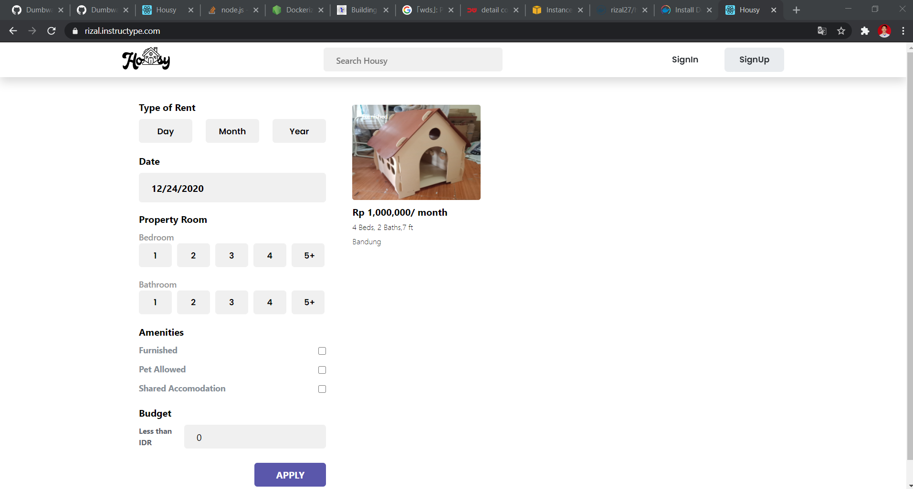

# Install Application

- Masuk ke folder housy agar memudahkan ketika setting job jenkins, lalu buat file docker-compose.yaml dengan konfigurasi seperti dibawah



- Lalu install docker compose dengan perintah-perintah berikut

```
curl -L "https://github.com/docker/compose/releases/download/1.27.4/docker-compose-$(uname -s)-$(uname -m)" -o /usr/bin/docker-compose
chmod +x /usr/bin/docker-compose
```



- Jalankan docker compose dengan perintah `docker-compose up -d`



- Lakukan juga di server lain



- Cek apakah berhasil

