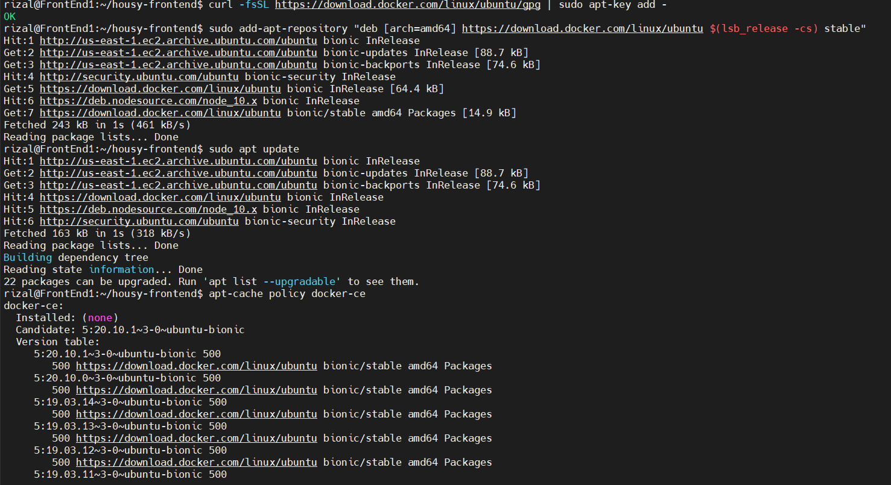
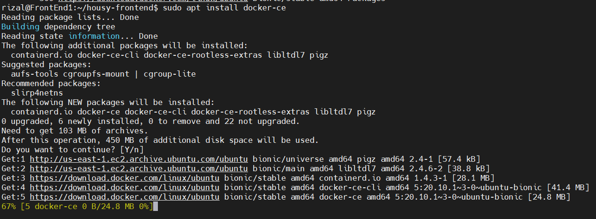
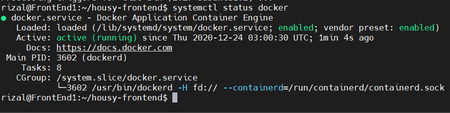
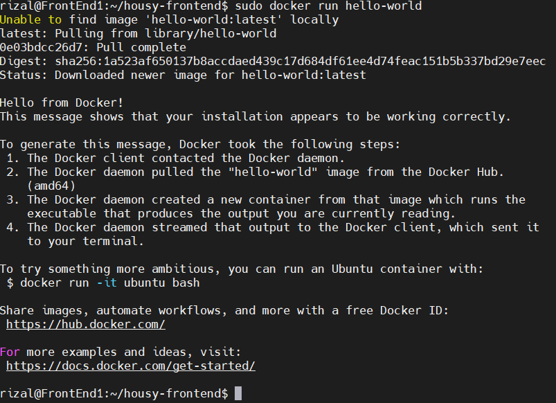
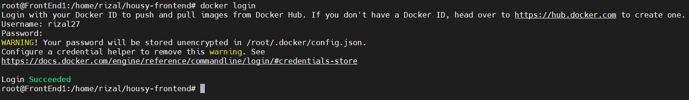

# Install Docker

- Masukan Repo dan install dengan perintah berikut

```
apt-get update
apt-get install apt-transport-https ca-certificates curl gnupg-agent software-properties-common
curl -fsSL https://download.docker.com/linux/ubuntu/gpg | sudo apt-key add -
add-apt-repository "deb [arch=amd64] https://download.docker.com/linux/ubuntu $(lsb_release -cs) stable"
apt-get update
apt-get install docker-ce docker-ce-cli containerd.io
```




- Cek docker



- Coba jalankan image hello world



- Login ke Docker

