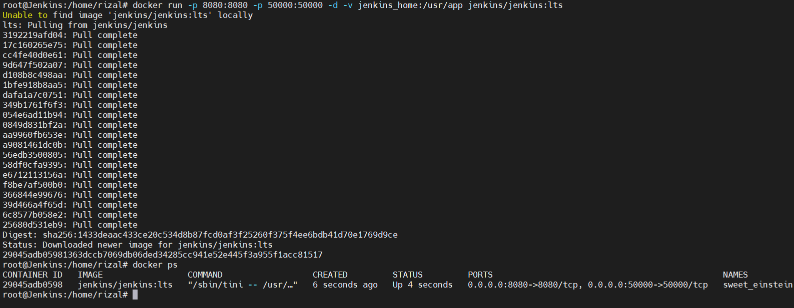
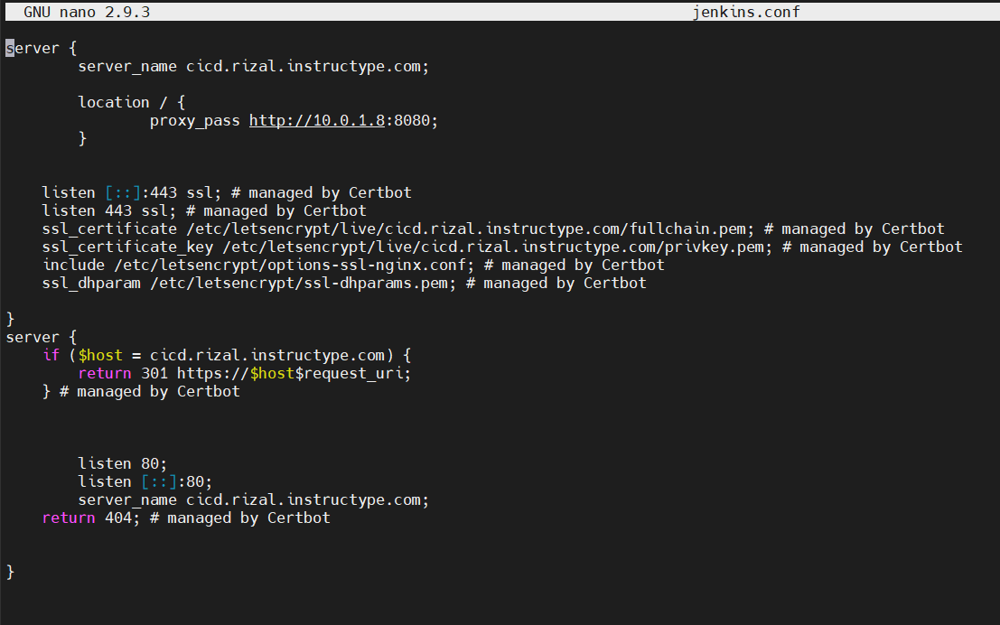

# Install Jenkins

- Buat server baru untuk jenkins, lalu install jenkins dari docker dengan perintah `docker run -p 8080:8080 -p 50000:50000 -d -v jenkins_home:/usr/app jenkins/jenkins:lts`

- Lalu buat konfigurasi reverse proxy untuk server jenkins

