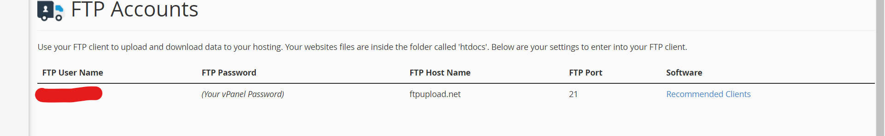
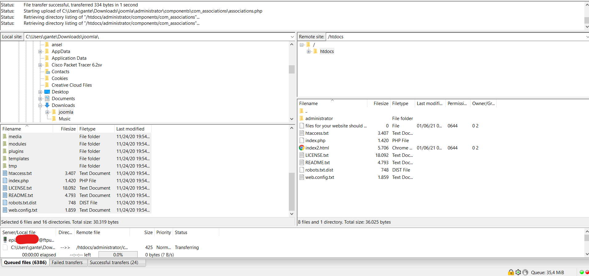
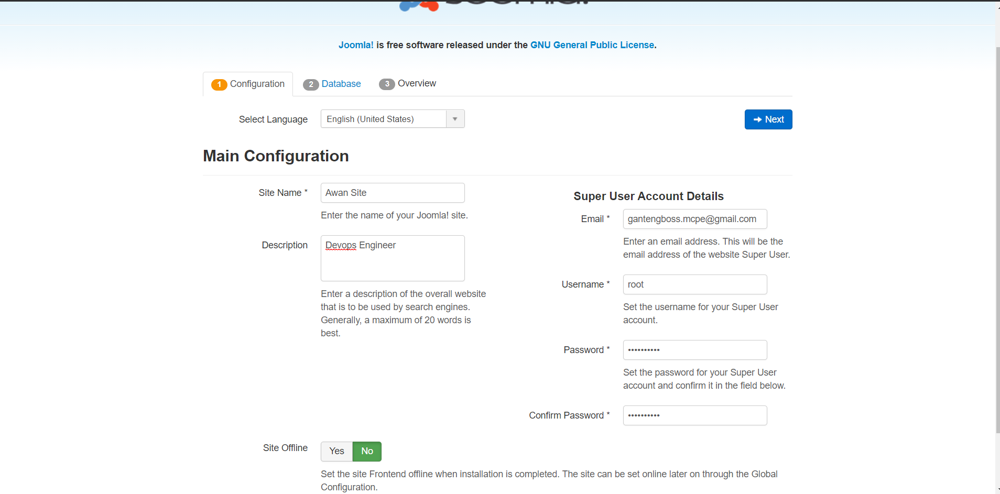
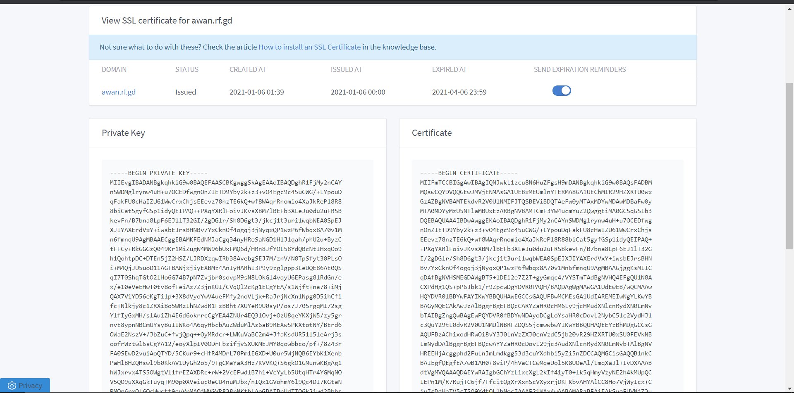
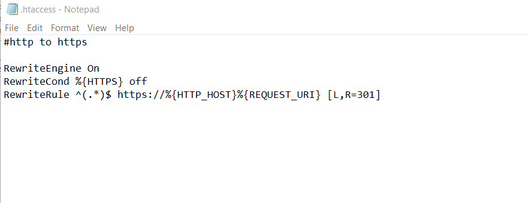
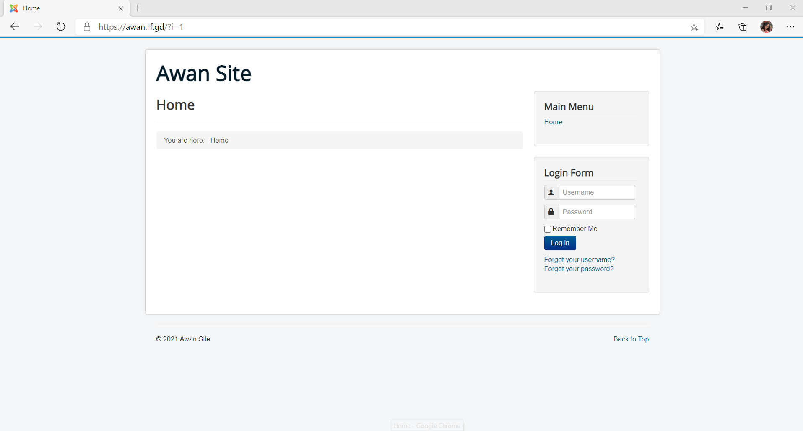

# Deploy PHP in CPANEL

- Untuk CMS saya menggunakan joomla
- Untuk CPANEL menggunakan InfinityFree
- Untuk SSL Menggunakan GoGetSSL
- Untuk FTP menggunakan FileZilla

- Download Joomla dan extract lalu pindahkan ke server dengan FTP

- Buka Domain dan setup Joomla

- Setelah selesai setup joomla, masuk ke menu utama infinityfree dan minta ssl untuk domain yang ada. Setelah itu salin private key dan certificate di menu ssl pada cpanel

- setelah itu redirect semua request http ke https dengan htaccess

- selesai

