# CICD

- Jalankan jenkins dengan playbook berikut

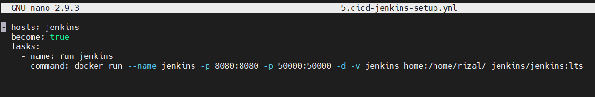
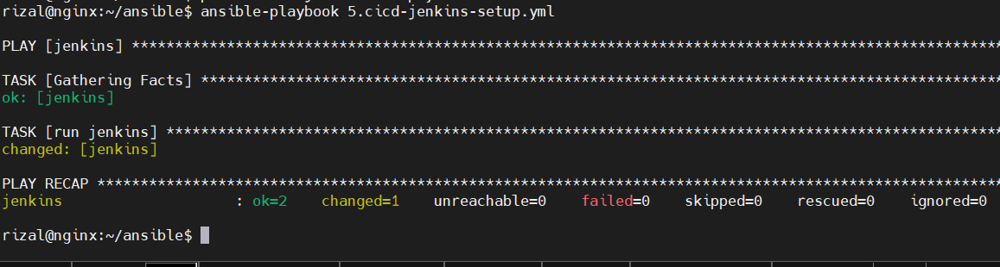

- salin password default jenkins dari container

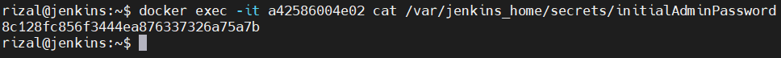
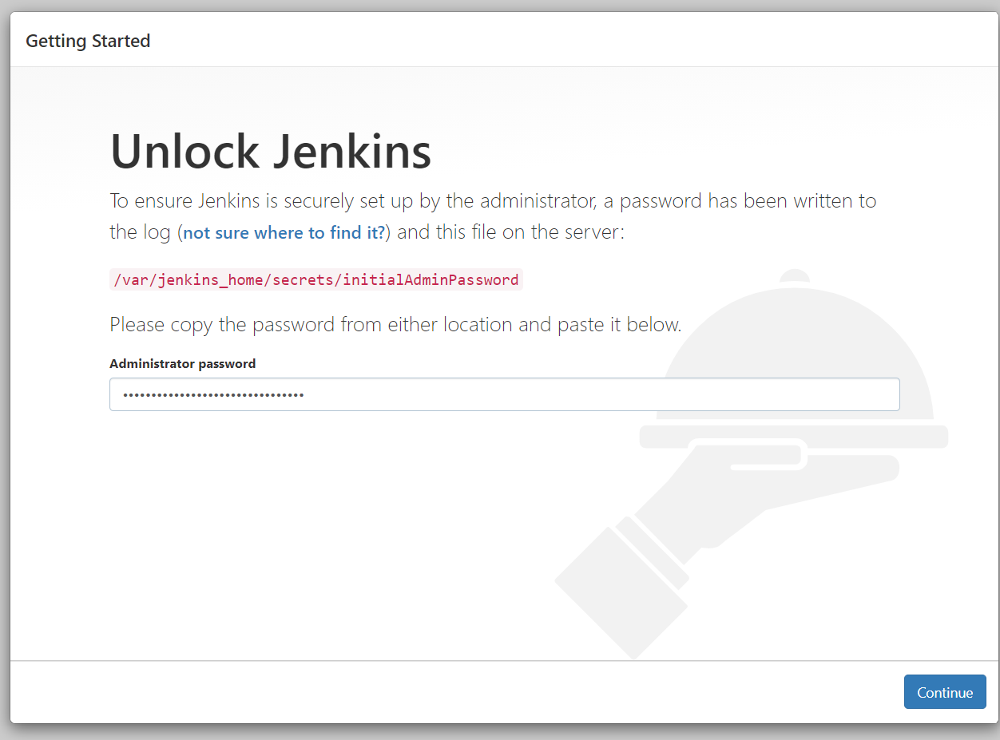

- Buat akun baru jenkins

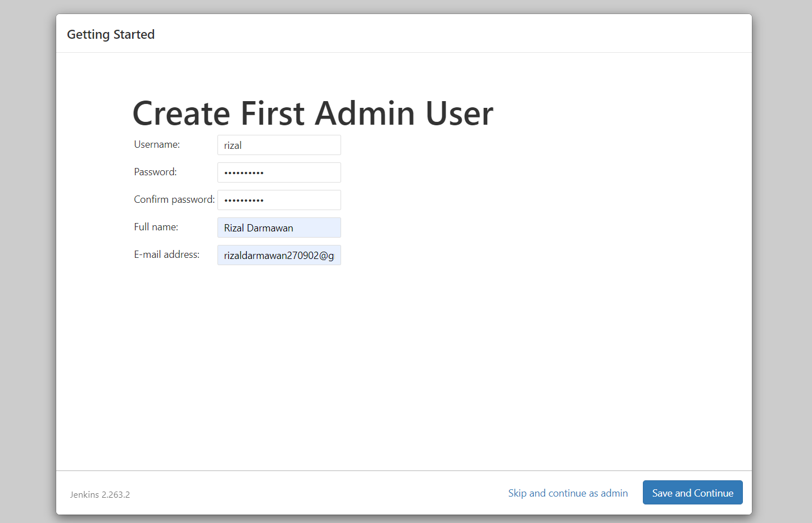

## Github autentikasi

- Salin Private key sebelumnya dan salin untuk autentikasi server kita dan untuk github

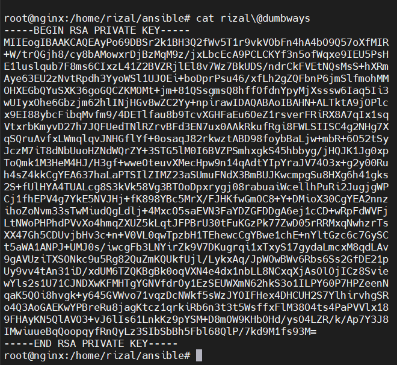
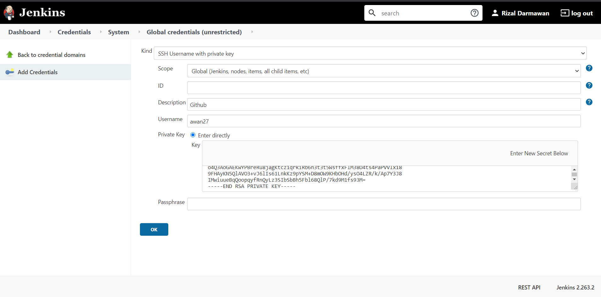

## Install Plugin

- Install plugin `Publish Over SSH` dan `Discord Notifier`

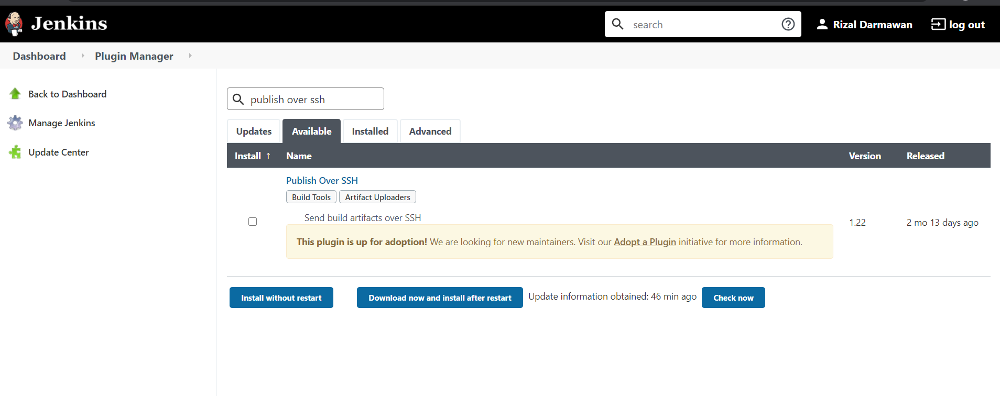
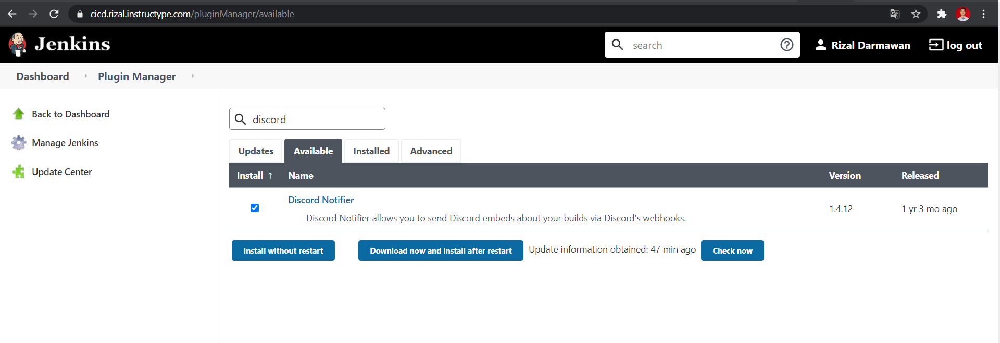

## Tambah Server

- Tambahkan server frontend dan backend, untuk passnya gunakan private key

## Create Job

- Buat Job untuk Frontend dengan freestyle

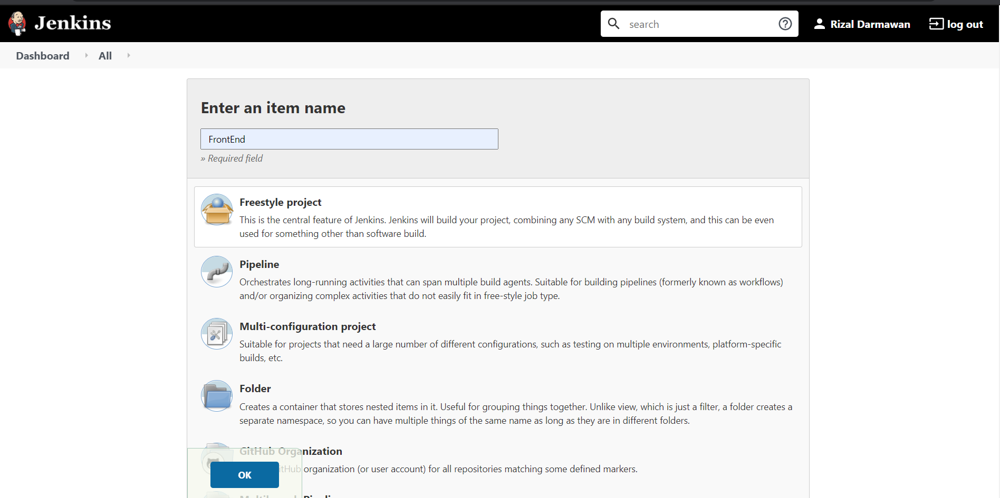

- isi sesuai gambar-gambar dibawah

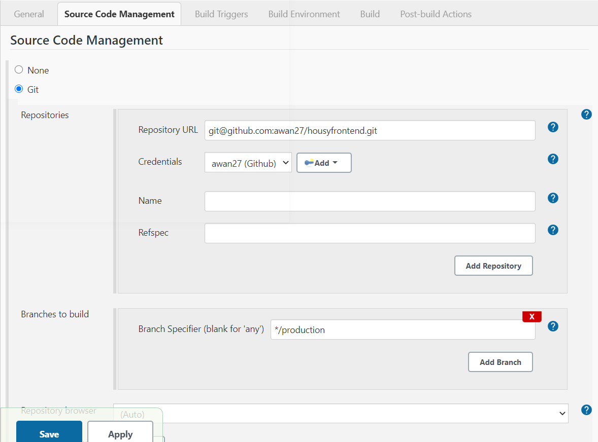
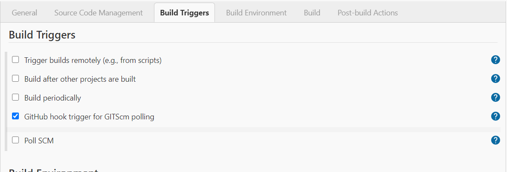

- Untuk Post Build masukan Discord Notifier dan salin webhook dari grup discord

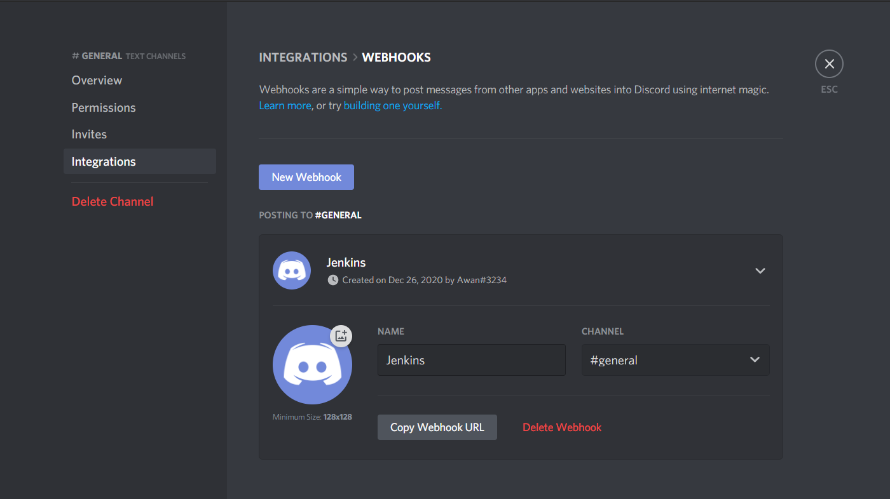
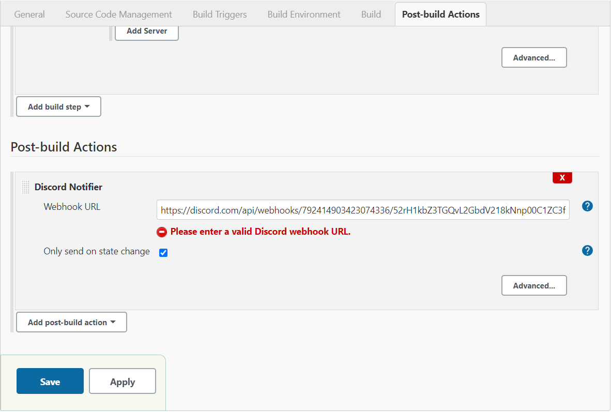

- Buat Webhook di github

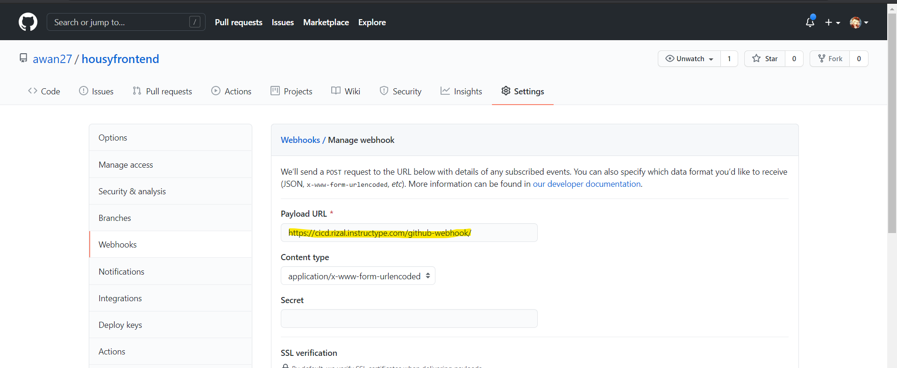

- Untuk yang backend settingnya sama, hanya beda pada build sedikit

## Test Automasi

- Coba push pada github, dan ini yang terjadi

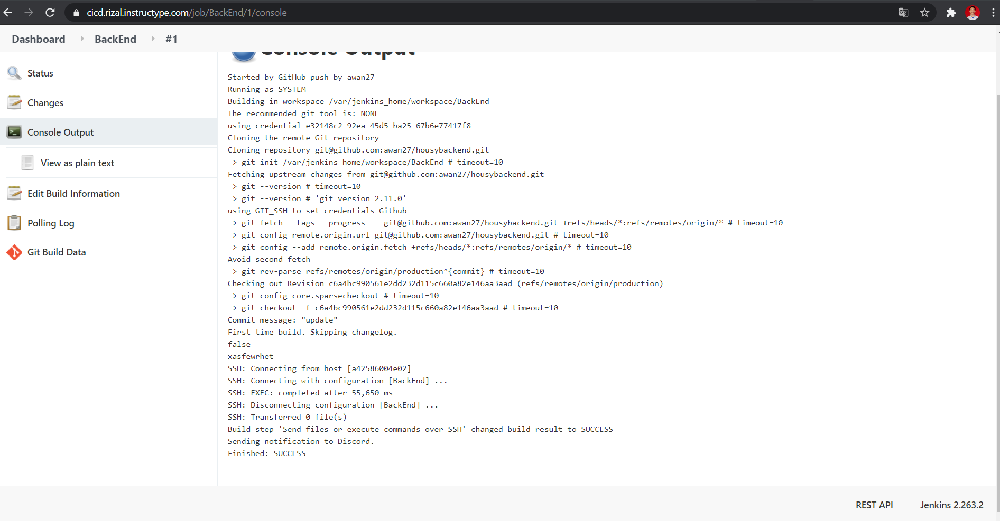
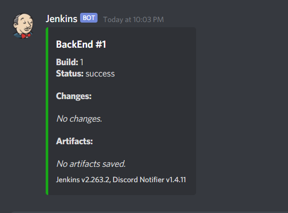
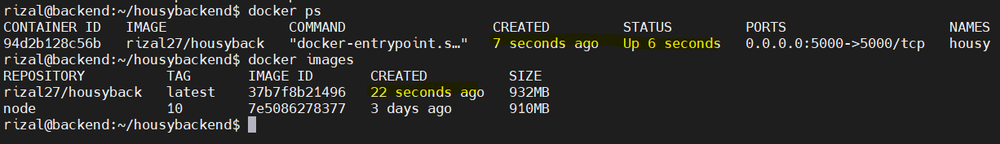