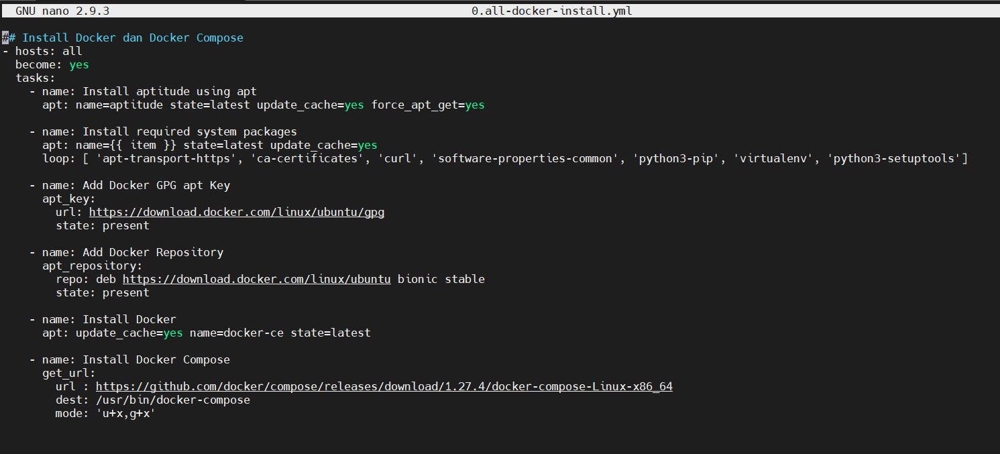
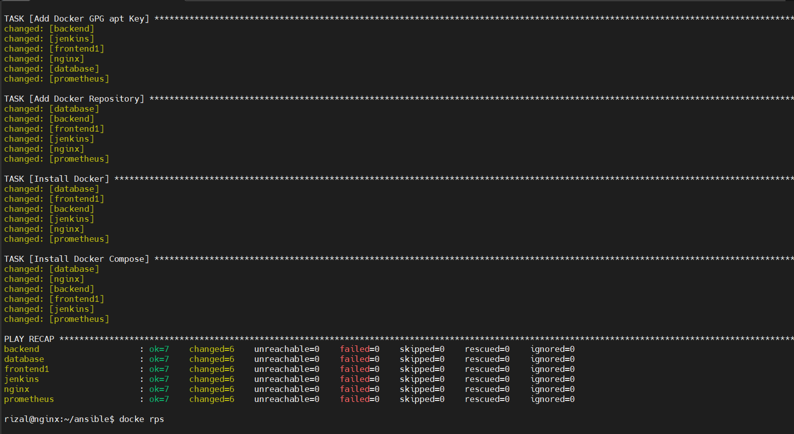
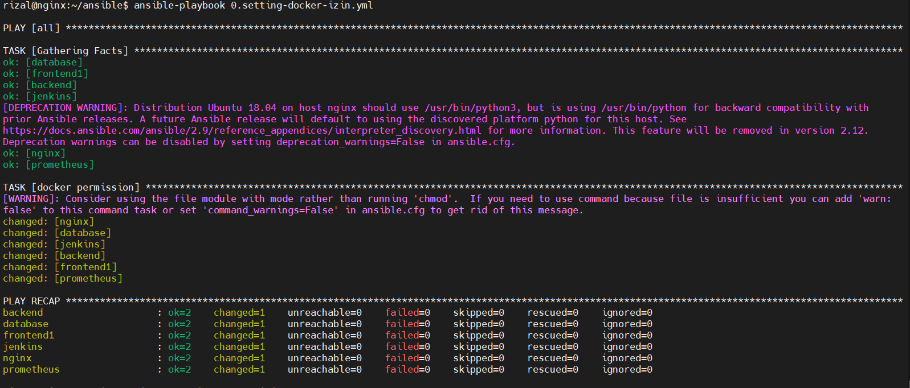
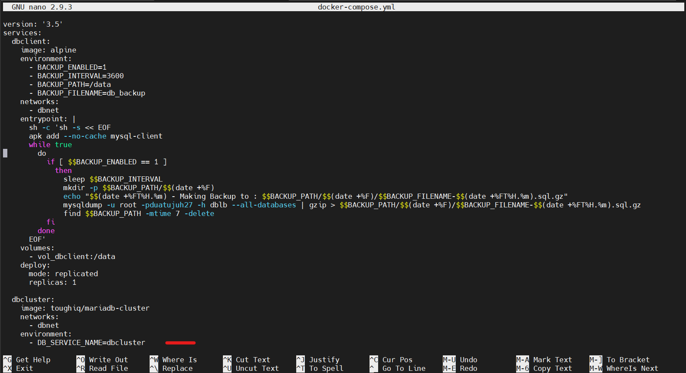
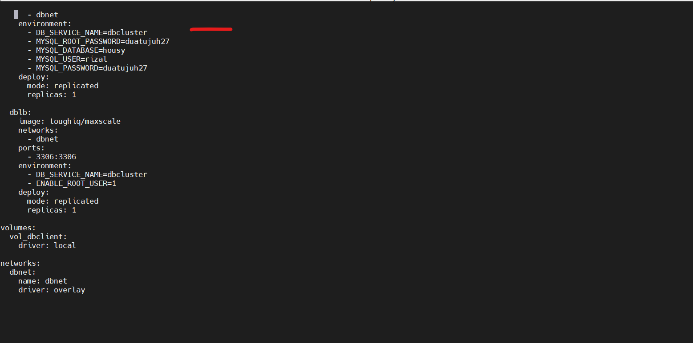
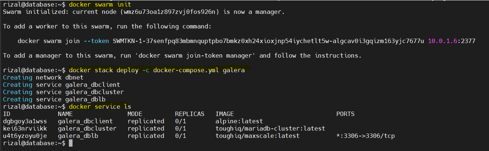
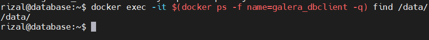
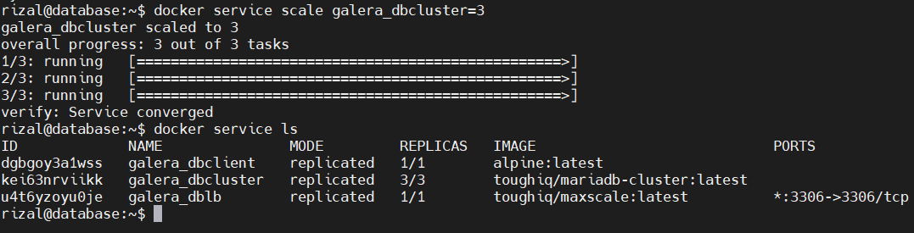
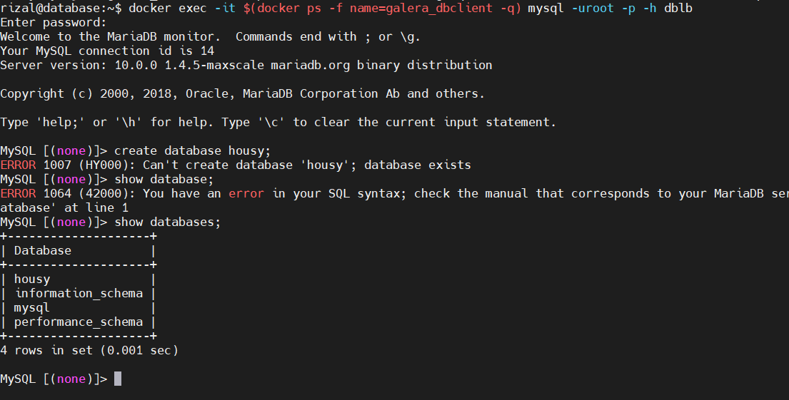

# Database

- Install Docker dan Docker Compose dengan playbook seperti berikut

- Jalankan playbook berikut agar docker dapat digunakan tanpa user root

- Docker compose berikut untuk menginstall database cluster dengan docker swarm

- masukan perintah-perintah dibawah ini untuk menjalankan docker composenya, setelah jadi servicenya akan ada 3

- untuk backup datanya ada di /data/

- selanjutnya kita akan scale cluster menjadi 3 cluster dari satu

- coba buat database housy

