# Deployment

- Pertama clone repository frontend dan backend dengan playbook berikut

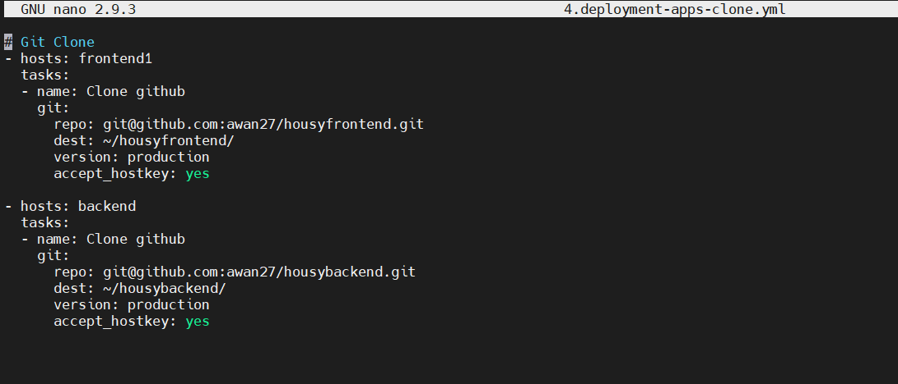
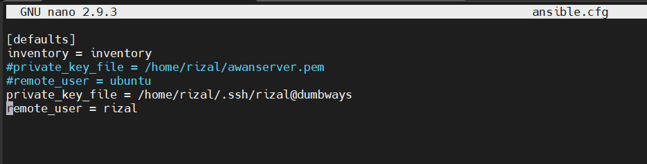
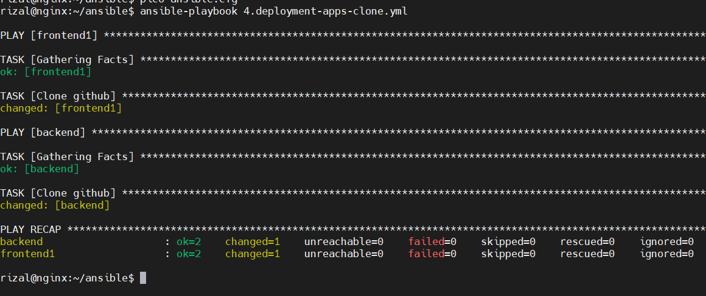

- cek branch reponya

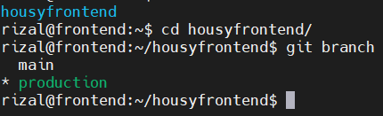
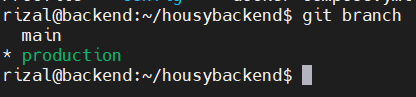

- Login Docker di server frontend dan backend

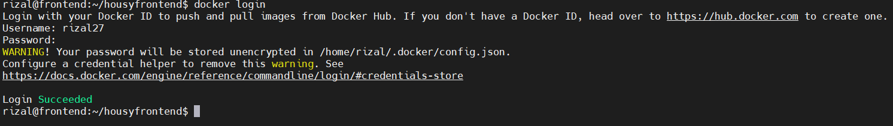
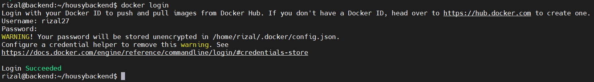

- Buat Dockerfile dan docker compose untuk frontend dan backend

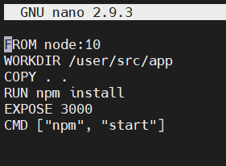
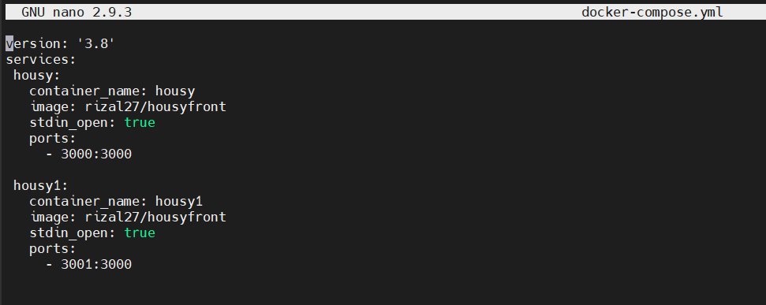
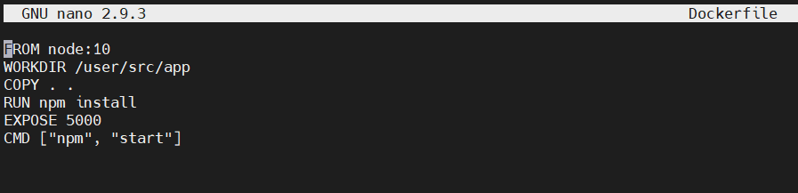
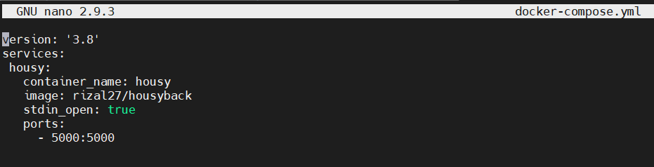

- edit api.js frontend

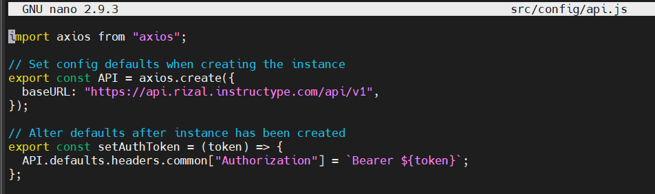

- edit config.js backend

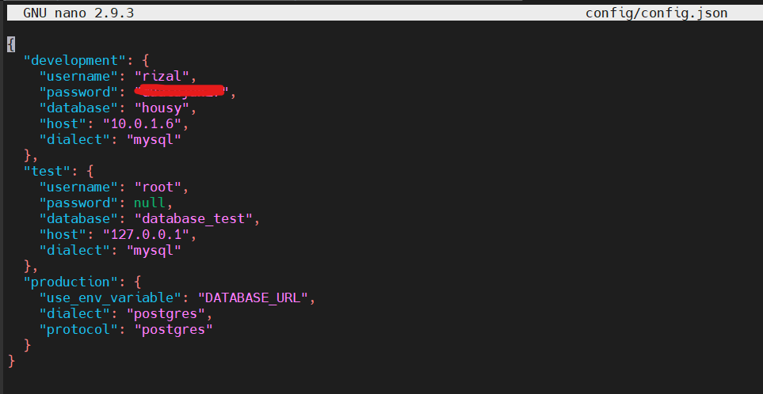

- build dan push image frontend dan backend

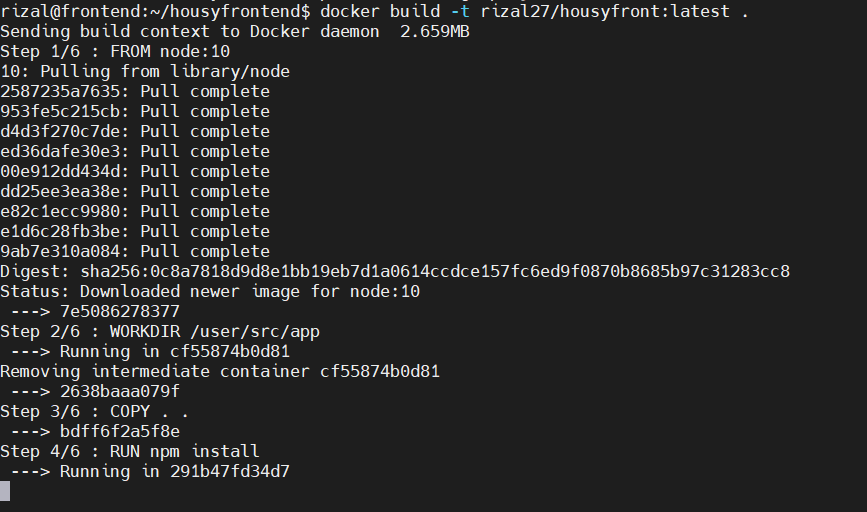

- jalankan docker-compose untuk kedua aplikasi

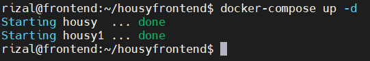
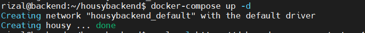

- install nodejs untuk backend, lalu npm install dan migrate database

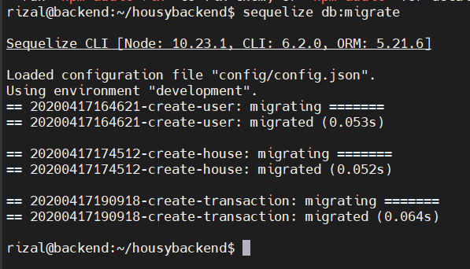

- Hasilnya

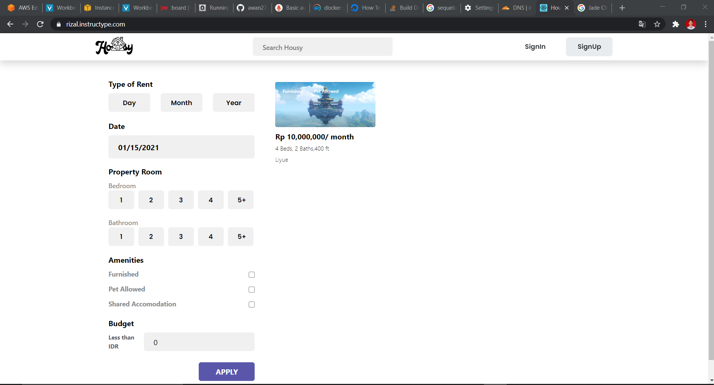