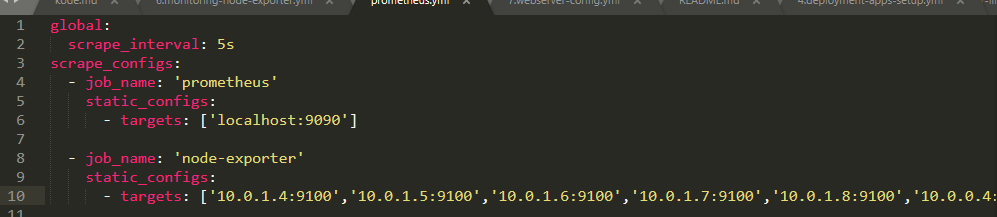
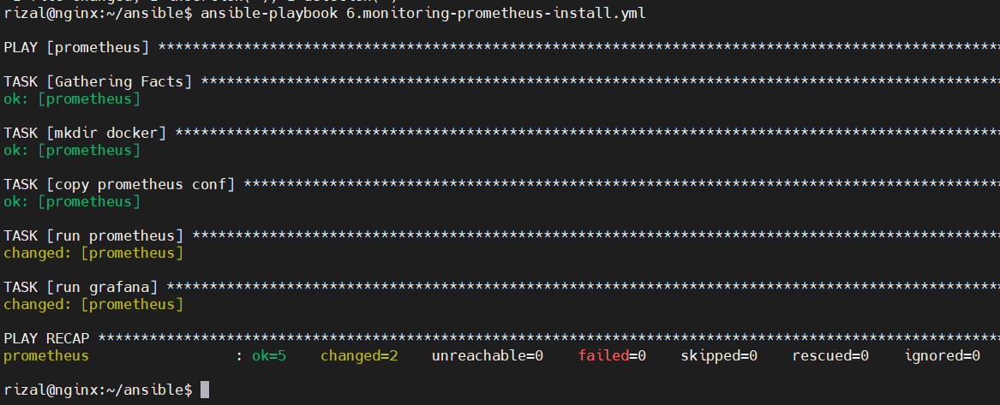
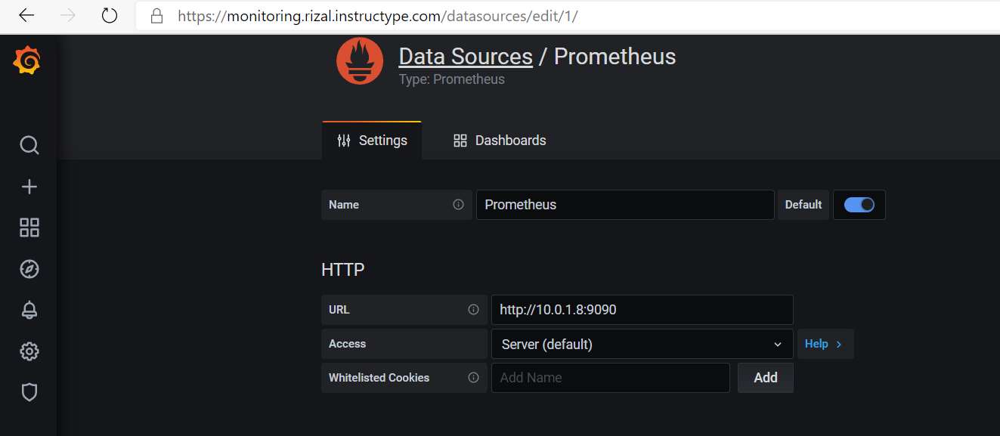
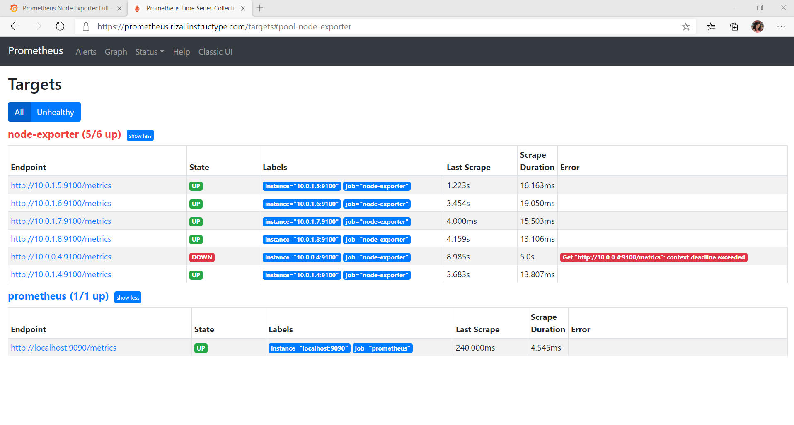

# Monitoring

- Install node exporter dengan playbook berikut

- Siapkan konfigurasi untuk prometheus

- Dan ini untuk install prometheus dan grafana

- Tambahkan Data Source dan import template di Grafana

- Terakhir cek Prometheus

