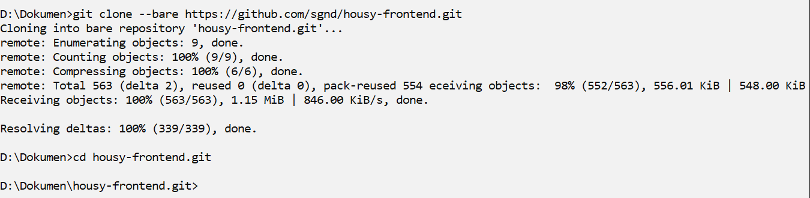
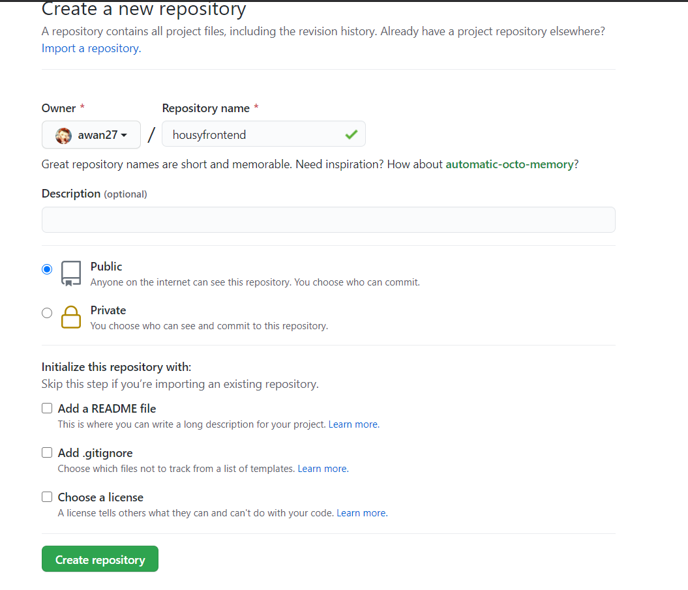
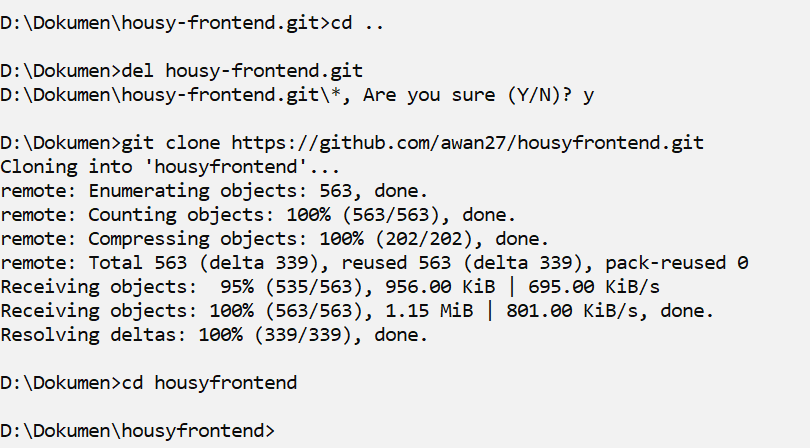
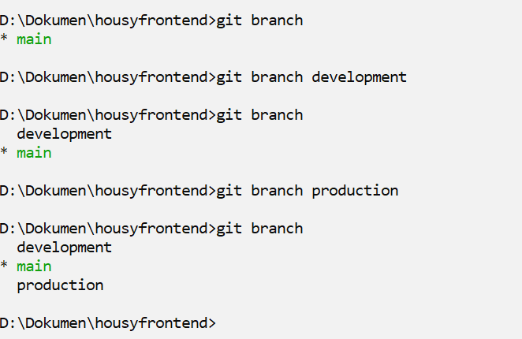
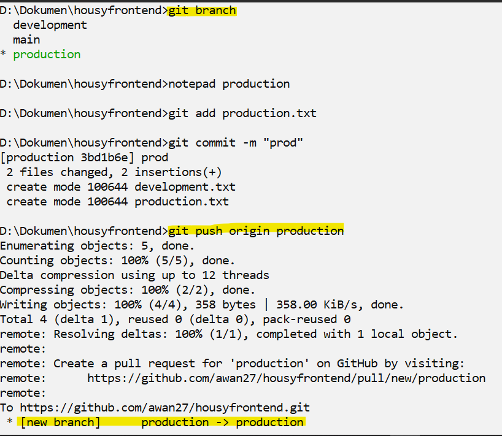
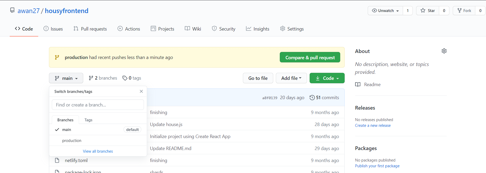
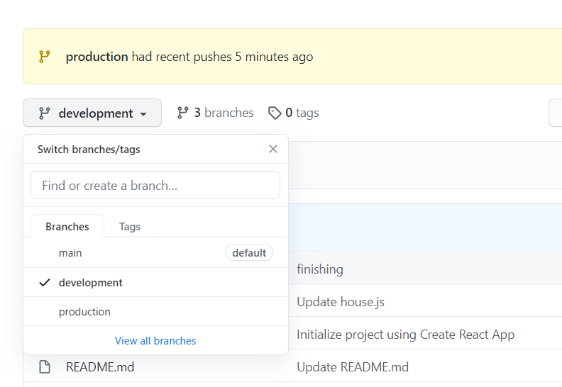

# Repository

- clone bare repo original

- buat repo baru kita

- push repo ori tadi ke repo baru

- hapus repo ori dan clone repo baru

- buat branch untuk development dan production, dan push

- cek di github

- untuk backend juga sama seperti sebelum-sebelumnya

