# Server AWS

- Buat VPC baru

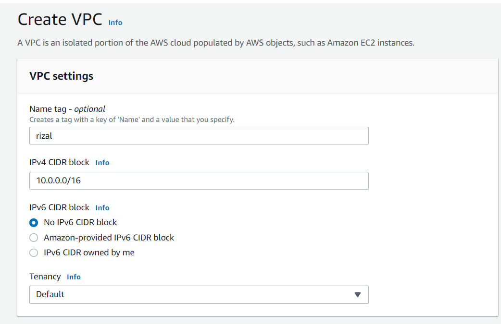

- Buat subnet private dan public

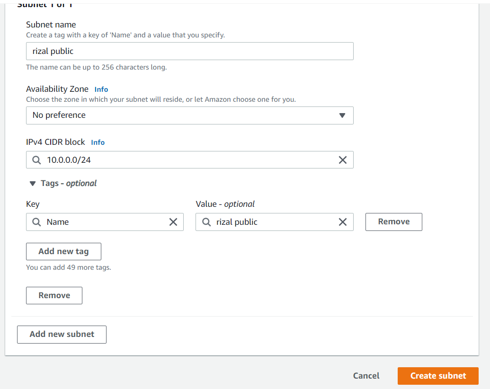
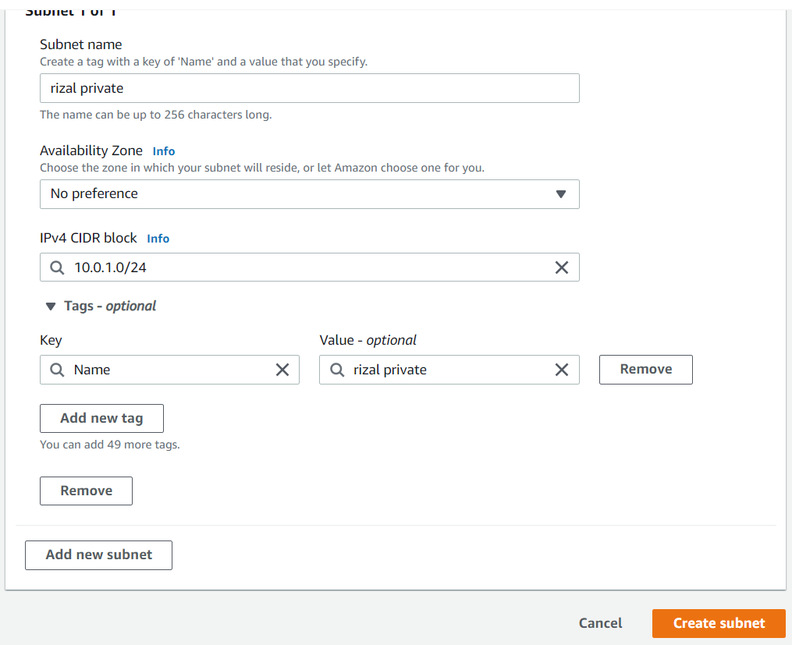

- Buat NAT gateway

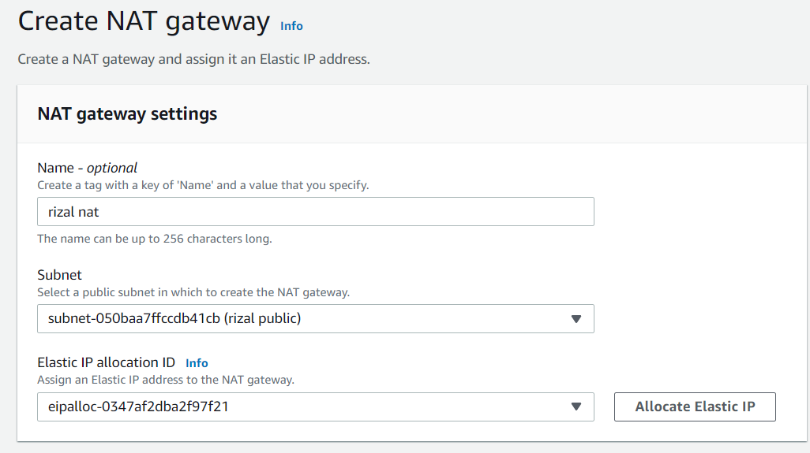

- Buat internet gateway dan attach ke VPC

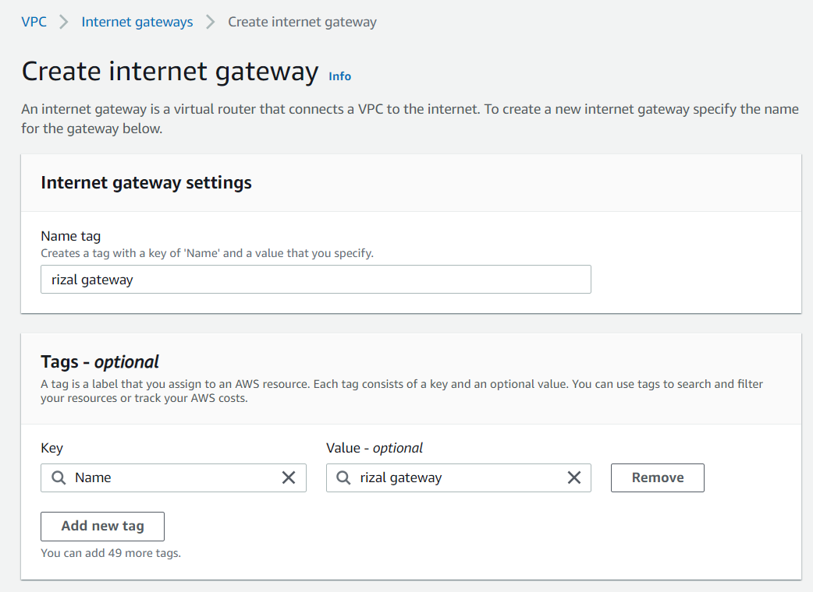
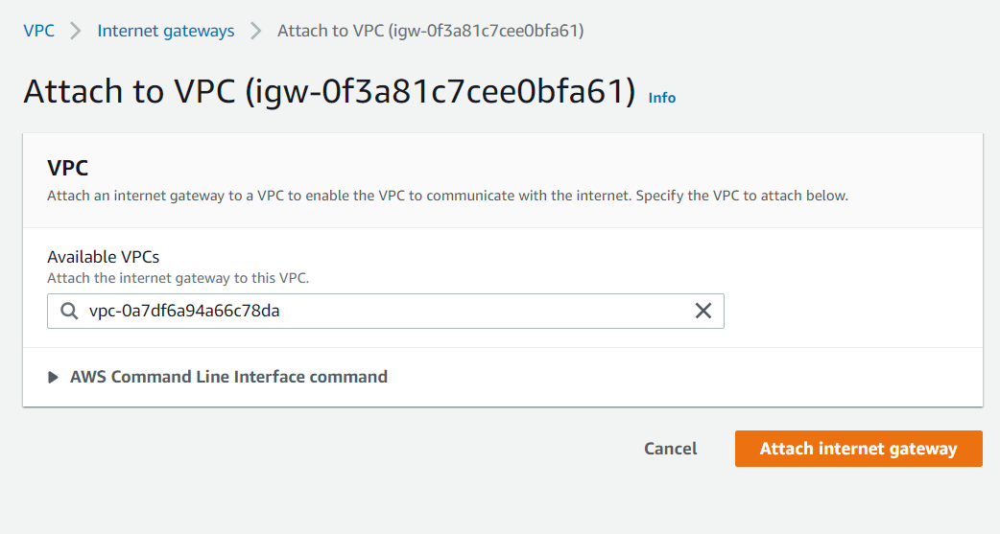

- Buat route table untuk public dan private subnet

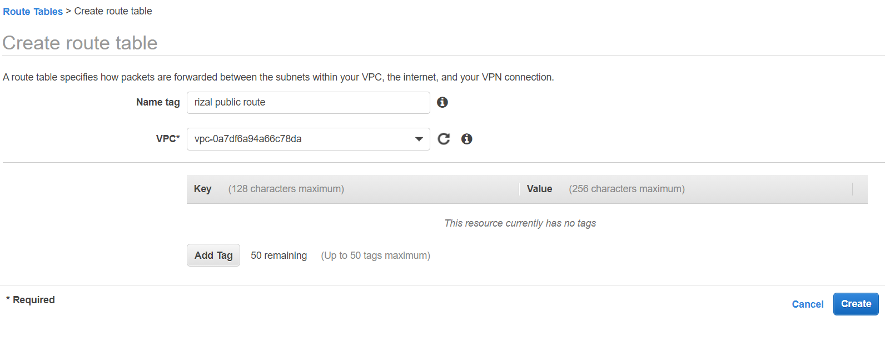

- yang ini untuk subnet public

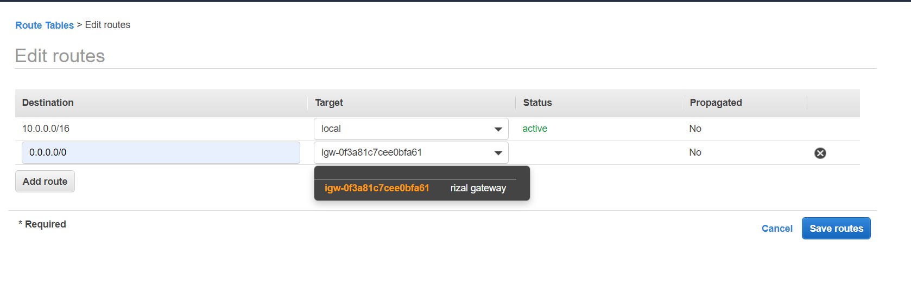

- yang ini untuk subnet private

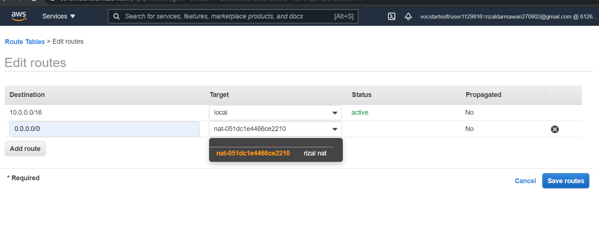

- Buat security group untuk public dan private

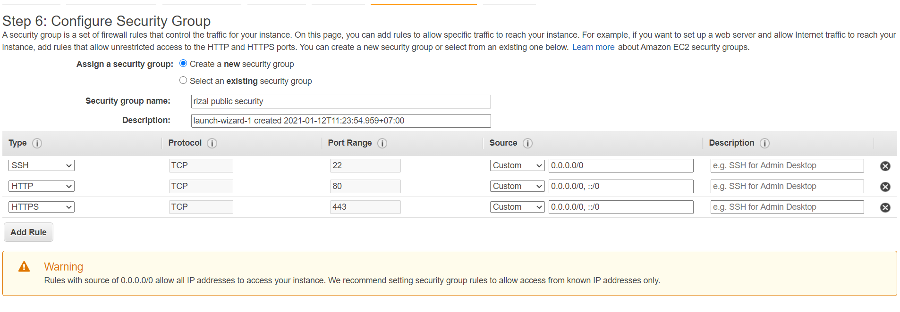
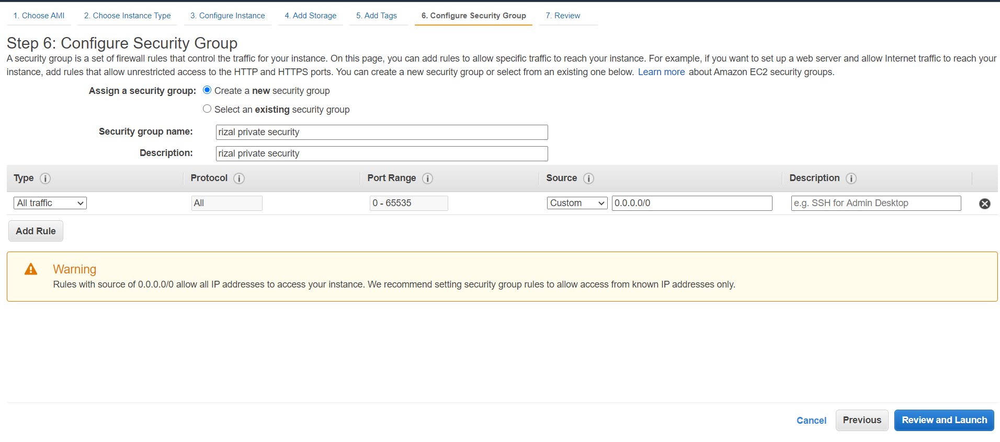

- Ini ketika semua telah dibuat

- Assosiate public ip ke nginx

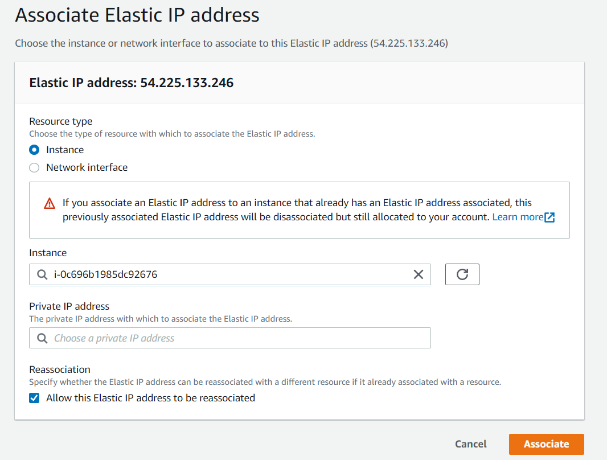