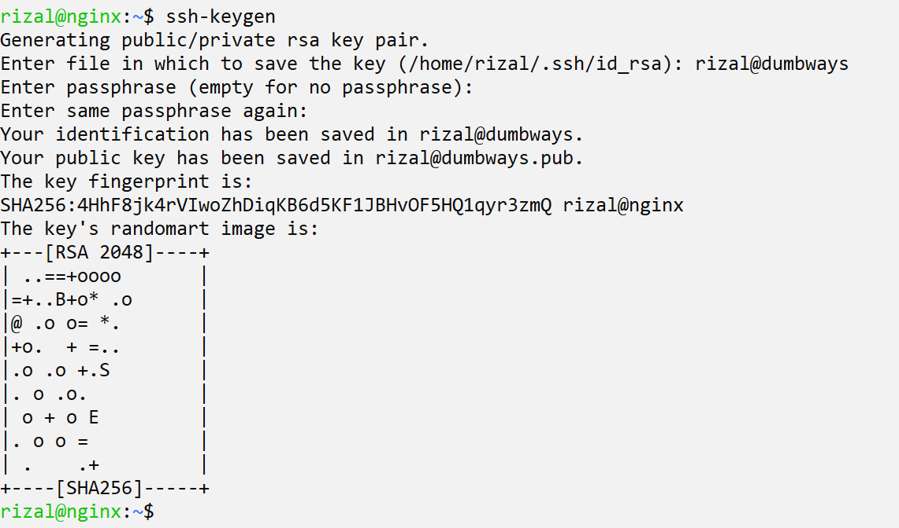
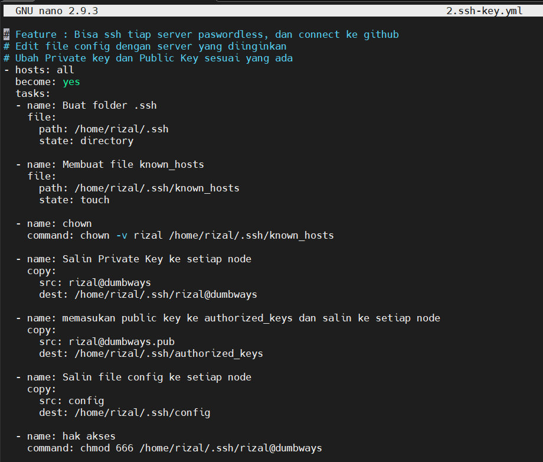
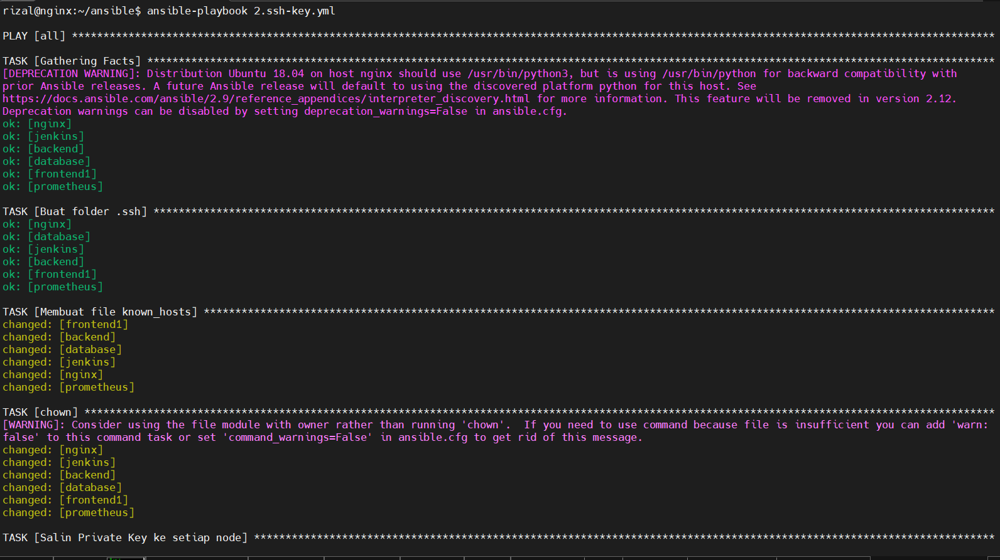
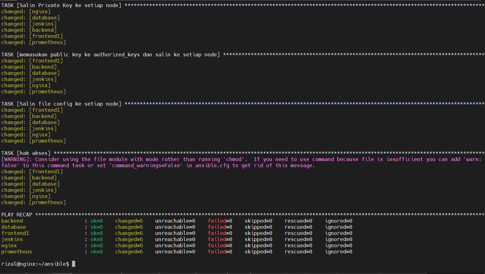
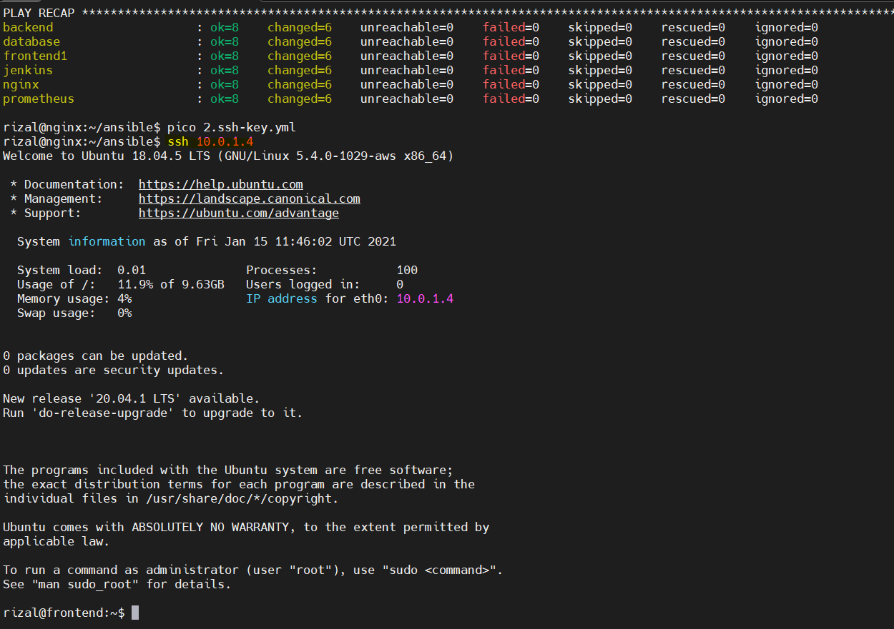
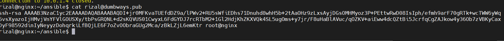
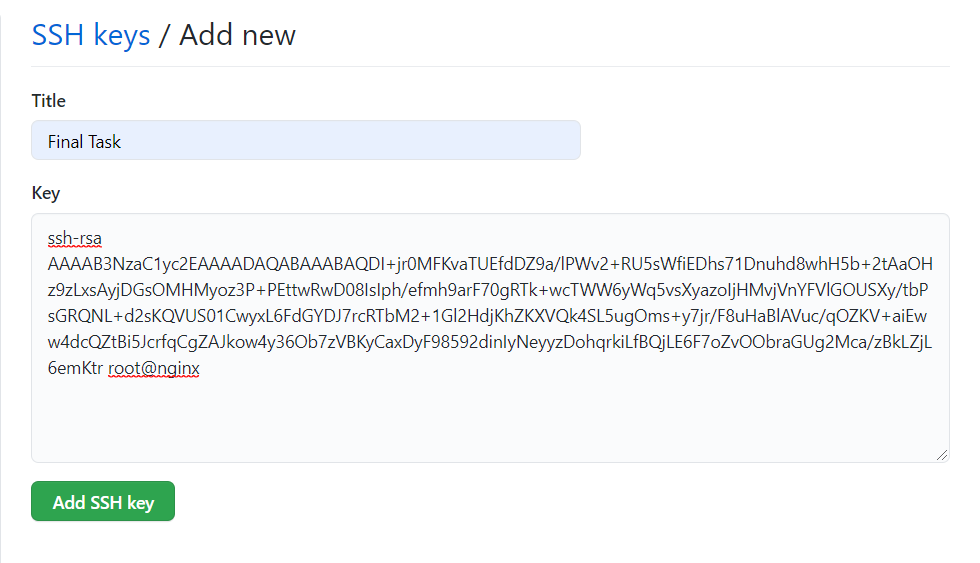
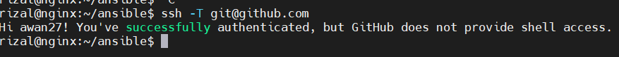

# SSH

- Generate SSH terlebih dahulu

;

- Lalu edit file config untuk diarahkan ke private key nanti

;

- Edit playbooknya sesuai kebutuhan

;

- jalankan playbooknya

;
;

- coba ssh ke server lain tanpa password

;

- salin pub key secara manual ke github

;
;

- coba tes sambung dengan ssh ke github

;