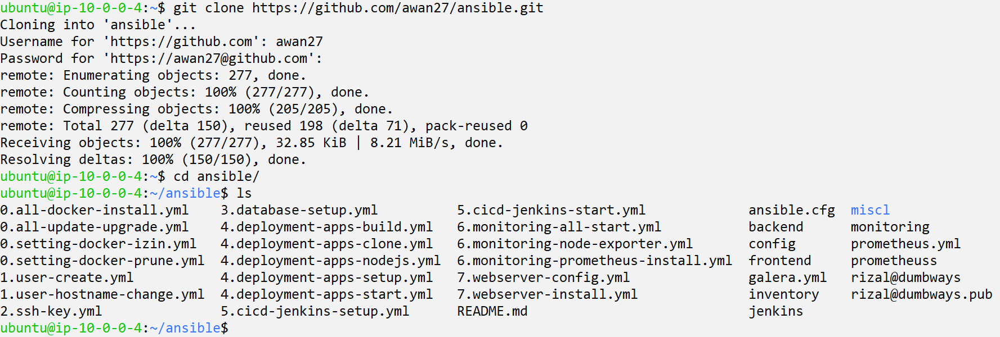
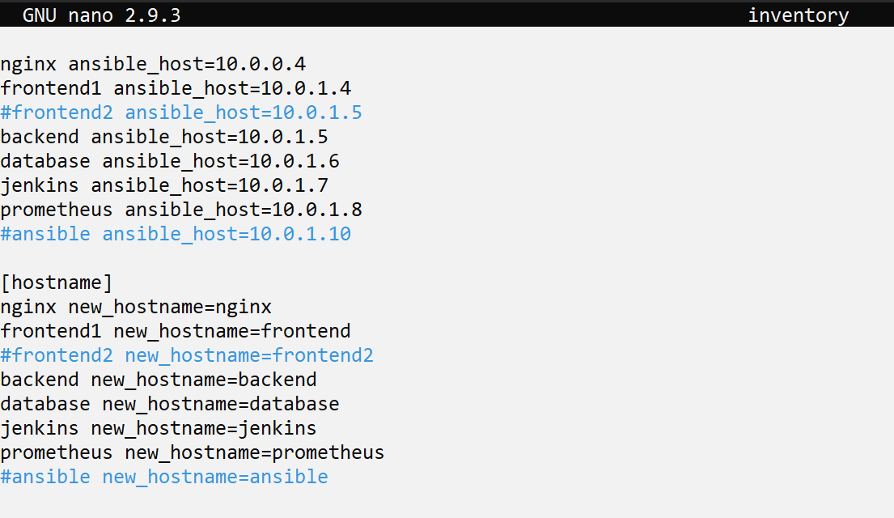
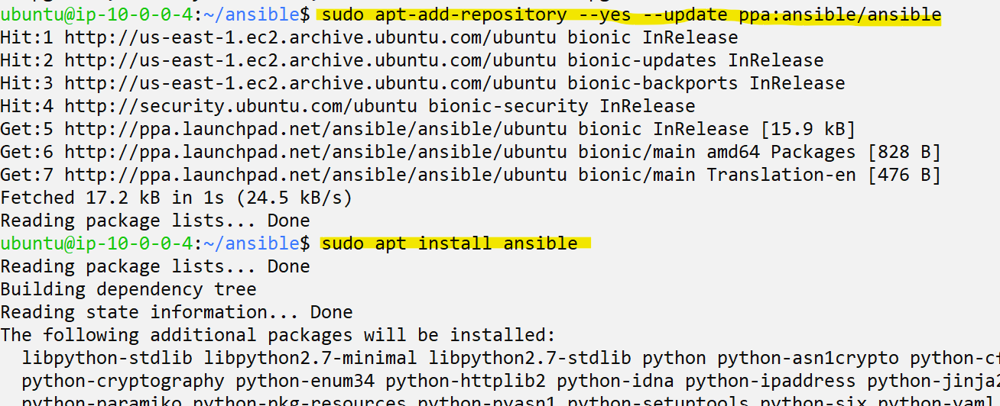
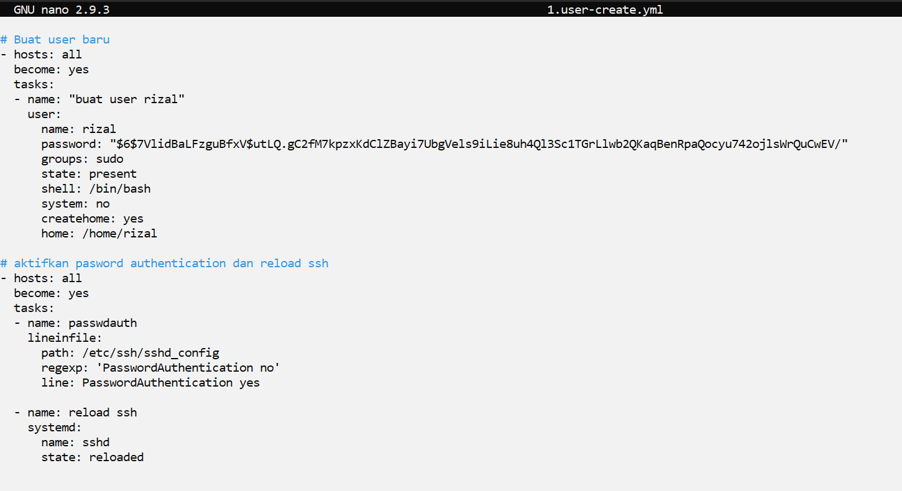
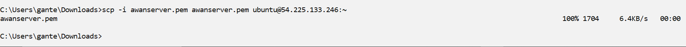
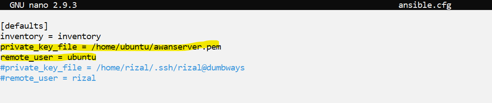
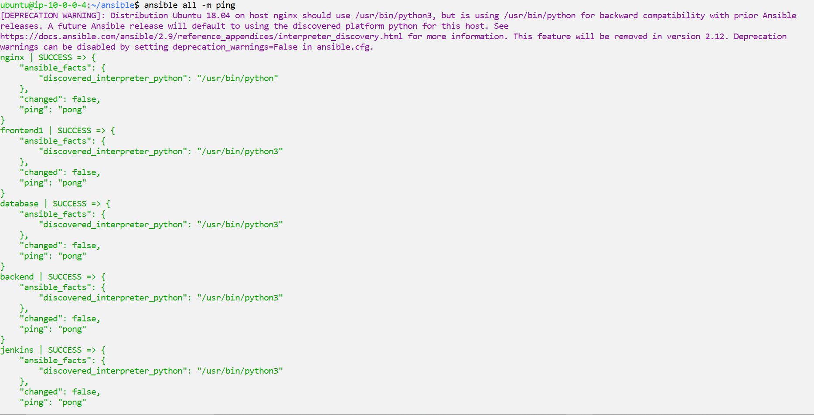
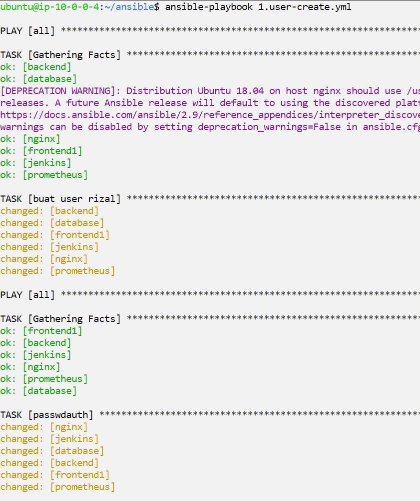
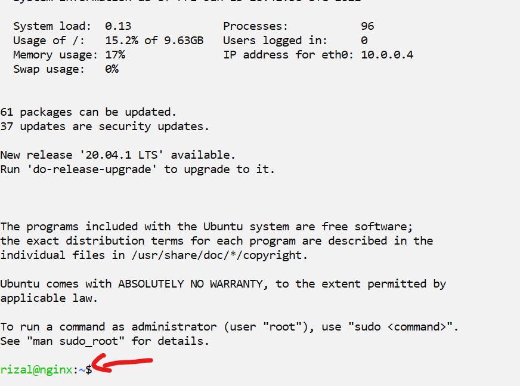

# Create User

- Pertama remote server dan clone ansible-playbook yang telah dibuat



- setelah itu edit inventory sesuai server yang ada



- selanjutnya install ansible dengan perintah-perintah berikut

```
sudo apt update
sudo apt install software-properties-common
sudo apt-add-repository --yes --update ppa:ansible/ansible
sudo apt install ansible
```



- cek playbook yang akan dijalankan



- cek ansible.cfg untuk user, jangan lupakan private key





- ping semua server agar meninggalkan fingerprint



- jalankan playbook untuk create user



- untuk bonus, saya akan mengubah hostname setiap server juga dengan playbook berikut


- Setelah itu coba masuk ke server tanpa key dari aws



